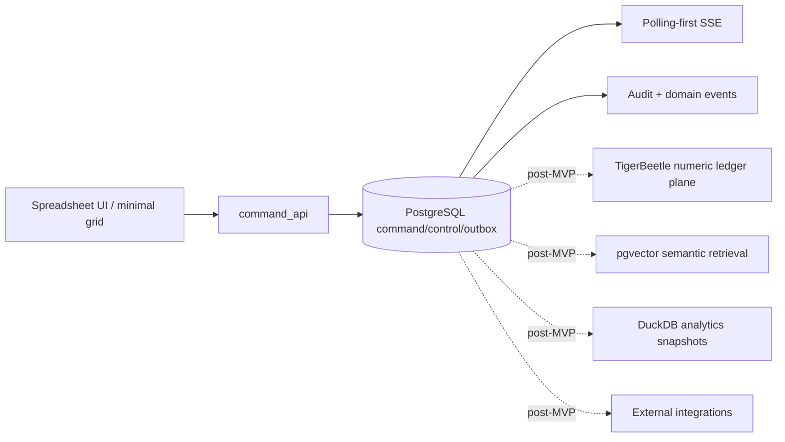

# START HERE — Spreadsheet-Native ERP v0.15.3 Snapshot

**Version:** 0.15.3  
**Last-reviewed:** 2026-06-26  
**Status:** First-read architecture and repository bootstrap snapshot

## Authority map



## Phase 0 target

```text
one safe spreadsheet edit
  -> command_log claim
  -> PostgreSQL business transaction
  -> audit/domain/outbox events
  -> polling-first SSE
  -> command-status recovery
```

## What agents may NOT do today

```text
1. Do not bypass command_api for any mutation.
2. Do not bypass outbox_events for outbound events or live updates.
3. Do not add TigerBeetle, pgvector, DuckDB, broker/CDC, or external connector runtime to Phase 0.
4. Do not build full tiled workspace before the vertical slice is green.
5. Do not weaken validation or invariants to make a PR pass.
```

## Repository shape

```text
apps/api      command API, outbox polling, SSE, integration staging stubs
apps/web      minimal spreadsheet UI shell
packages/*    domain, db, contracts, config, observability, testkit, ui
```

Start coding only after reading:

```text
AGENTS.md
docs/implementation/phase0-agent-work-orders.md
docs/implementation/project-directory-structure.md
```
