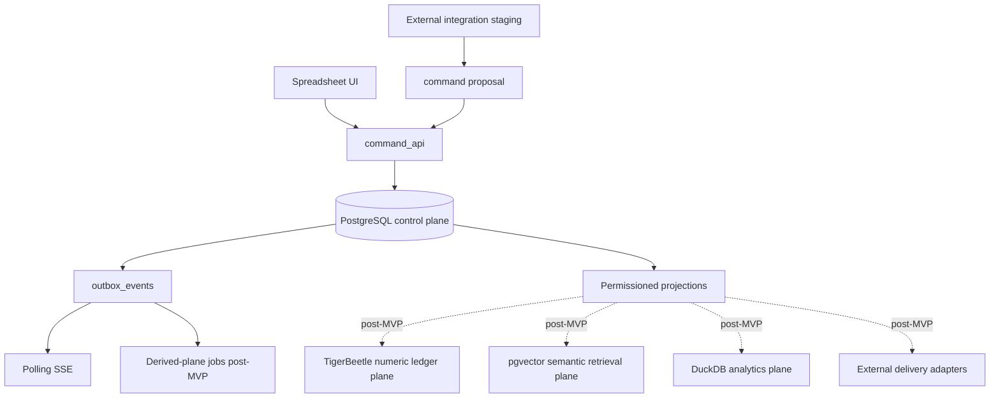

# Spreadsheet-Native ERP v0.15.1 Architecture Snapshot

**Version:** 0.15.1  
**Status:** First-read implementation snapshot for humans and AI coding agents  
**Purpose:** Give every contributor the same one-page mental model before touching code.

## Target of Phase 0

Build one safe spreadsheet edit end to end:

```text
cell edit
  -> command_api
  -> command_log claim
  -> PostgreSQL business transaction
  -> current state + audit_events + domain_events + outbox_events
  -> polling SSE delivery
  -> command-status recovery after lost response
```

## System authority map



## Non-negotiable rules

```text
1. All business mutations go through command handlers.
2. Durable outbox polling is the MVP live-update path.
3. Security invariants are release-blocking CI evidence, not prose.
4. Post-MVP planes are derived/evidence-gated and feature-flagged off in Phase 0.
5. AI coding agents execute one scoped work order per PR unless a reviewer approves otherwise.
6. Layouts, tiles, vectors, analytics, integrations, and ledger shadows never become hidden mutation paths.
```

## Locked implementation order

```text
P0-EXEC-001 -> P0-CMD-001 -> P0-LIVE-001 -> P0-INV-001 -> P0-BATCH-001 -> P0-RATE-001 -> vertical slice acceptance
```

`P0-EXEC-001` validates the agent execution process. It does not change the product gate order.

## First files to read

| Role | Required first files |
|---|---|
| Any contributor | `docs/snapshot-v0.15.1.md`, `README.md`, `docs/pack-index.md` |
| AI coding agent | `AGENTS.md`, `docs/implementation/phase0-agent-work-orders.md` |
| Backend/API | `docs/dev/command-lifecycle.md`, `docs/skeletons/CommandHandlerBase.ts` |
| Platform/SRE | `docs/dev/outbox-polling-reader.md`, `docs/skeletons/OutboxPoller.ts` |
| Frontend | `docs/dev/client-optimistic-ui-and-conflicts.md`, `docs/ui/transposed-record-view-contract.md` |
| Security | `invariants/security-invariants.yml`, `docs/security/threat-model-summary.md` |
| QA | `tests/manifest.yml`, `docs/qa/agent-implementation-validation-plan.md` |

## Immediate non-goals

```text
TigerBeetle runtime cutover
pgvector production retrieval
DuckDB user-facing analytics
CDC/broker fan-out
external connector marketplace
full tiled workspace
AI-generated autonomous writes
```

These are prepared by contracts and feature flags only.

## Merge rule

A PR may merge only when:

```text
bash scripts/validate-pack.sh
```

passes, or when a non-release-blocking warning is explicitly waived through `docs/process/decision-waiver-log.md` using the validator waiver mode.
