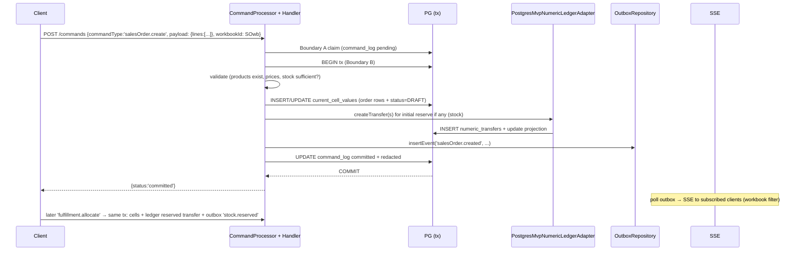

# Domain Data Model and Business Logic for SME Online Ecommerce + Owned Warehouse Operations

**Document ID:** SPEC-DOMAIN-ECOM-WH-001  
**Title:** Spreadsheet-Native ERP v0.17.0 Phase 0 — Data Tables/Workbooks and Business Logic Applications for Basic SME Ecommerce with Owned Warehouse  
**Author:** (Systems Architect / AI Agent)  
**Date:** 2026-06-30  
**Version:** 0.17.0  
**Status:** Approved  
**Scope:** Phase 0 runtime only (command_api + handlers, durable outbox polling, current_cell_values storage, PostgresMvpNumericLedgerAdapter, `compilePartitions` from BatchPartitionCompiler policy module, RetrievalRevalidator path for derived)  
**Audience:** Senior engineers, Phase 0 implementers, AI coding agents  

**Mandatory prerequisite reads (verified):**  
- `AGENTS.md` (non-negotiable boundaries)  
- `docs/snapshot-v0.17.0.md`  
- `docs/implementation/phase0-agent-work-orders.md` (esp. AGENT-012, AGENT-040, AGENT-090)  
- `docs/implementation/project-directory-structure.md`  
- `spec/spreadsheet_native_erp_technical_spec_v0_17_0_research_driven_phase0_bootstrap_complete_execution.md`  
- `docs/data/pilot-dataset-definition.md` (envisioned Product, Warehouse, StockBalance, StockReservation)  
- `docs/data/ledgerability-classification.md`  
- `docs/data/numeric-ledger-contract.md` (MVP schema + stock modeling rule)  
- `docs/dev/batch-partition-policy.md` (Union-Find, partitionKeys, customDomainRules)  
- `docs/dev/command-lifecycle.md` (Boundary A/B, tx, NumericLedgerPort participation)  
- `packages/db/migrations/0001_command_outbox_core.sql` (current_cell_values PK, numeric_* tables, outbox envelope)  
- `packages/db/src/postgres.ts` (3-workbook seed using item_name, InMemoryQueryable + real PostgresQueryable, workspace_nodes/edges)  
- `packages/domain/src/commands/types.ts` (CommandEnvelope, CommandOutcome)  
- `packages/domain/src/policies/BatchPartitionCompiler.ts` (exports `compilePartitions` function; re-exported via `packages/domain/src/index.ts`)  
- `apps/api/src/commands/CommandHandlerBase.ts` (executeBusinessLogic inside tx context)  
- `packages/domain/src/ledger/NumericLedgerPort.ts` (PostgresMvpNumericLedgerAdapter + createTransfer)  
- `workbooks/inventory/batch-partition-policy.yml` (partitionKeys, foreignKeys, formulaReferences, customDomainRules)  
- `docs/ui/spreadsheet-native-ux-specification.md` (dynamic columns, trailing empty row, cell.update, module switcher, transposed/relations)  

**Related implementation files (cited throughout):**
- Critical review & UX alternatives: `docs/data/sme-ecommerce-schema-critical-review-and-ux-alternatives.md` (recommended refinements for column metadata, action integration, cross-tile reactivity, grouped rendering, bypass mitigations)  
- `apps/api/src/commands/CommandProcessor.ts` (Boundary A claim + Boundary B tx with ledger + outbox insert + command status)  
- `apps/api/src/server.ts` (demo handlers for 'cell.update'/'row.delete', ALLOWED_WORKBOOKS, workbook query via current_cell_values, registration)  
- `apps/api/src/commands/handlers/SalesHandlers.ts` (current `salesOrder.create` + `salesOrder.confirm` implementation surface)
- `apps/api/src/commands/handlers/PurchaseHandlers.ts` (current `purchaseOrder.create` + `purchaseOrder.receive` implementation surface)
- `apps/api/src/routes/commands.ts`  
- `apps/api/src/outbox/OutboxRepository.ts` (insertEvent in tx, deterministic event_id/idempotency_key)  
- `packages/contracts/src/command-api.ts` (SubmitCommandRequest with workbookId)  
- `packages/contracts/src/events.ts` (OutboxEnvelope, InsertOutboxEventParams)  
- `packages/db/src/transaction.ts` (withTransaction, TransactionClient)  
- `apps/web/src/lib/commandClient.ts` (submitCommand, polling)  
- `apps/web/src/components/BusinessCommandCenter.tsx` (business-actions tile for domain command entry)
- `apps/web/src/lib/workbookConstants.ts` (ALLOWED_WORKBOOKS allowlist definition + isAllowedWorkbook)
- `apps/web/src/lib/workbookUtils.ts` (uses it for resolve/assert)
- `apps/web/src/app/page.tsx` (imports + multiple uses for tabs/SSE/nav)
- `apps/api/src/server.ts` (local const re-definition of ALLOWED_WORKBOOKS + checks in /commands, /workbooks, /events paths)
**Duplication note (Issue 2 resolution):** ALLOWED_WORKBOOKS is currently duplicated (definition in web lib + hardcoded const + includes() guards in api/server.ts). All new workbook additions require coordinated edits to prevent drift. PR plan below explicitly lists every location and includes allowlist sync notes. Long-term: extraction to shared (e.g. packages/contracts/src/allowed-workbooks.ts) is desirable but for Phase 0 vertical follow-on we document dual-maintenance.  

**Verified paths and citation notes** (re-verified 2026-06-27 via direct file reads + grep; citations use "around line X" or section names where exact lines can drift):
| File | Key verified elements | Citation approach |
|------|-----------------------|-------------------|
| `packages/domain/src/commands/types.ts` | CommandEnvelope<TPayload> with payload | Exact (lines 4-11) |
| `apps/api/src/commands/CommandHandlerBase.ts` | abstract class, commandType (17), executeBusinessLogic (65) | Exact; use line for abstract decl |
| `apps/api/src/commands/CommandProcessor.ts` | Boundary B tx around 340-410 (ledger new, handler.execute, outbox insert, status) + AUD-001 comment | "around 340 (txSpan) to ~410" |
| `apps/api/src/server.ts` | Demo handlers (49+), ALLOWED_WORKBOOKS checks (multiple ~239+), /workbooks column discovery (329+), registration (178) | "around X" or "in request paths" |
| `packages/db/src/postgres.ts` | Pilot seeds + workspace_edges with item_name (70+), cells in InMemoryQueryable | "around 70 (edges), 76-139 (seeds)" |
| `packages/domain/src/policies/BatchPartitionCompiler.ts` | export function compilePartitions (140); returns Mutation[][] | Exact + sig |
| `packages/domain/src/index.ts` | export * from policies (re-exports compilePartitions) | Exact line 4 |
| `0001_command_outbox_core.sql` | current_cell_values (301), numeric tables | "around 301" |
| `apps/web/src/lib/workbookConstants.ts` + `page.tsx` + `server.ts` | ALLOWED_WORKBOOKS duplication | Full list in Issue 2 section |

---

## Overview

This document defines the **domain data model** (logical spreadsheet workbooks/tables, column contracts, keys, relations, validation, physical mapping) and **business logic applications** (core commandTypes/handlers, workflow state machines, invariants, side effects) required for basic SME online ecommerce operations backed by an owned warehouse.

The solution integrates **directly** into the existing Phase 0 architecture:

- All mutations via `SubmitCommandRequest` → `CommandProcessor.processCommand` → registered `CommandHandlerBase` subclasses → `executeBusinessLogic(envelope, {tx, ledger, ...})` inside single PostgreSQL transaction (see `apps/api/src/commands/CommandProcessor.ts` around 340 (txSpan) through ~410 (outbox insert) and withTransaction call).
- `current_cell_values` (tenant_id, workbook_id, row_id TEXT, column_id TEXT, value_text) remains the Phase 0 physical store for workbook data (`packages/db/migrations/0001_command_outbox_core.sql` around 301-310 (PK + index); seeded in `packages/db/src/postgres.ts` around 76-139 (pilot workbooks) for Sales Orders / Inventory Stock / Purchase Ledger).
- Numeric conserved quantities (stock qty, AR, COGS, cash, inventory valuation) go exclusively through `NumericLedgerPort` (MVP `PostgresMvpNumericLedgerAdapter`) participating in the same tx (`docs/data/numeric-ledger-contract.md`, `packages/domain/src/ledger/NumericLedgerPort.ts`).
- Live updates via durable `outbox_events` (polling-first SSE) with CloudEvents-compatible envelope (`docs/data/event-envelope-contract.md`, `OutboxRepository.insertEvent`).
- Transactional batching for multi-mutation commands driven by per-workbook `batch-partition-policy.yml` + `compilePartitions` function from `packages/domain/src/policies/BatchPartitionCompiler.ts` (re-exported from `packages/domain/src/index.ts`; sig: `compilePartitions(mutations: Mutation[], policy: BatchPartitionPolicy, timeoutMs?: number = 200): Mutation[][]` using Union-Find on partitionKeys etc.).
- Dynamic columns discovered from data (`apps/api/src/server.ts` around 329-360 (cells query + columnIds map + label derivation)); trailing empty row + `cell.update`/`row.delete` UX preserved (`docs/ui/spreadsheet-native-ux-specification.md`).
- Tenant isolation via RLS + explicit tenant/workbook allowlists; audit/domain events + command_log correlation (AUD-001).
- Derived results (available stock = onhand-reserved, order totals) use command-computed cell writes + batch policy formula refs + future `RetrievalRevalidator` (do not bypass).

Primary recommendation: **Spreadsheet Domain Command Model** (hybrid). Users interact via familiar grid (dynamic cols, cell edits for ad-hoc), but complex business operations use coarse-grained domain commandTypes that atomically update multiple cells + ledger + outbox. This maximizes synergy with tx boundaries, outbox reactivity, batch compiler, ledger conservation, and spreadsheet flexibility while enforcing invariants.

Expected scale for basic SME (Phase 0): <50k SKUs/locations, <1k orders/day peak, low concurrency; cell storage + Postgres projections sufficient; p99 command tx <200ms target (aligned with batch SLOs).

---

## Background & Motivation

Current state (verified via source):
- Pilot seeds exactly 3 workbooks (`000...002` Sales Orders, `000...003` Inventory Stock, `000...004` Purchase Ledger) using `item_name` string matching for cross-workbook "relations" (see workspace_edges in `postgres.ts:70-76`, e.g. "deducts stock via item_name").
- Fragile linking (string names, no stable ids) is explicitly called out as risk in pilot and relations graph (`docs/ui/...`, `ExplorerPanel`, `WorkbookGraph`).
- `pilot-dataset-definition.md` explicitly envisions Product/Warehouse/StockBalance/StockReservation + editable projection `Available = onhand - reserved`.
- Ledgerability: stock on-hand, reservations are ledgerable (conserved quantities with debit/credit accounts); prices/tax rates/config are not (`docs/data/ledgerability-classification.md:30-50`, `numeric-ledger-contract.md:280-290` stock status accounts).
- Primitive commands (`cell.update`, `row.delete`, graph add) still exist for the bootstrap vertical slice, but API handlers now also implement `product.create`, `inventory.adjust`, `salesOrder.create`, `salesOrder.confirm`, `purchaseOrder.create`, `purchaseOrder.receive`, and the extended master-data command set. The web shell exposes a business-actions tile for these domain flows while keeping all writes on `command_api`.
- Batch policy example at `workbooks/inventory/batch-partition-policy.yml` already uses `productId` + `warehouseId` partitionKeys (perfect for inventory synergy).
- Command tx guarantees (docs/dev/command-lifecycle.md:20-50): single PG tx with ledger + current + audit + domain + outbox + terminal status. No blind retries; status polling recovery.
- UI: module switcher between workbooks, dynamic column discovery, SSE subscription per workbookId, optimistic status.

Pain points addressed:
- No modeled ecommerce flows (order lifecycle, allocation, fulfillment, 3-way receive, basic AR/cash/COGS).
- Inability to enforce domain invariants (e.g. no negative stock on reserve, 3-way match basics) when users can freely `cell.update`.
- String-based cross-workbook links break reactivity and queryability.
- Missing ledger postings for real stock movements and financial effects.
- Derived values (available qty, order total, margin) either manual or absent, risking inconsistency vs. batch policy.
- No path for user extension (add columns) while protecting rules.

This spec closes the gap for "basic SME business operations" while respecting every Phase 0 boundary.

## Implemented Phase 0 Command Surface

As of 2026-06-30, the current repository implementation covers these domain commands in addition to the primitive grid/graph commands:

- `product.create`
- `inventory.adjust`
- `salesOrder.create`
- `salesOrder.confirm`
- `purchaseOrder.create`
- `purchaseOrder.receive`
- `productTemplate.create`
- `productVariant.create`
- `party.create`
- `customer.create`
- `supplier.create`
- `address.create`

Allocation, fulfillment, invoicing, payment, and returns remain specified here but are still follow-on implementation slices.

---

## Goals & Non-Goals

### Goals
**"Basic" scope definition (for coverage):** Core operations for online sales + owned single-warehouse: catalog (with cost/tax_rate), customers/suppliers, locations, stock control (onhand/reserved via ledger), sales order create/confirm/allocate/ship (flattened lines), PO create/receive (basic 3-way), fulfill + simple AR/cash/COGS (standard cost), and return/receipt reversal. 

Advanced features (full tax engine with jurisdictions/rates rules, multi-bin/serial/lot, complex tolerance 3-way workflows, full credit memo lifecycle, backorders with allocation rules, landed costs) are explicitly deferred beyond this spec.

- Define 8 canonical logical workbooks with explicit column contracts (id/sku/ref keys, typed conceptual: text|numeric|enum|date|ref, required/unique/partition), example data shapes.
- Define 10-12 core domain `commandType`s (e.g. `salesOrder.create`, `inventory.adjust`, `fulfillment.allocate`, `order.fulfillShip`, `purchaseOrder.receive`) with payload shapes, validation, exact tx writes (cells + ledger + outbox events), failure modes.
- Specify workflow state machines (cells for status + transition commands enforcing invariants).
- Define ledger account patterns and transfer examples for stock + money flows (using existing `numeric_ledger_catalog`/`accounts`/`transfers`).
- Show how derived values computed (command writes projection cell + formulaReferences in policy for batch grouping).
- Define event taxonomy emitted into outbox (e.g. `salesOrder.created`, `stock.moved`).
- Provide batch partition policies for new workbooks.
- Full synergy evaluation of alternatives (data modeling × command granularity × fulfillment timing) vs. **all** system elements.
- Concrete compatibility/migration path (Phase 0 cells → future structured via canonical docs/migrations).
- User extensibility model (add columns) preserving rules.
- Risks called out with mitigations.
- Mermaid diagrams for architecture, sequence, ledger.
- PR Plan of small, ordered, reviewable increments post-AGENT-090 vertical slice (respecting canonical locations, no violations).
- Produce polished, citable spec.

### Non-Goals (Phase 0 hard boundaries)
- No new DDL/CREATE TABLE outside canonical locations (`docs/data/*-contract.md` + `packages/db/migrations/` following schema-evolution-playbook.md). Design proposes future canonical extensions only.
- No TigerBeetle, pgvector, DuckDB, broker/CDC, external connector runtime, full tiled workspace.
- No bypass of command_api, outbox polling, or RetrievalRevalidator.
- No direct cell writes or UPDATE outside handlers/tx.
- No weakening of RLS/tenant allowlists/command identity.
- Do not plan implementation of formula worker or full retrieval here.
- Not a complete finance close or multi-warehouse WMS; "basic" SME scope.

---

## Proposed Design

### Canonical Workbooks (Logical Tables)

Workbooks identified by stable UUID (extend allowlist in `workbookConstants.ts` + `server.ts:35-41` + API validation). Physical storage: rows in `current_cell_values` + dynamic columns discovered server-side. Row IDs: stable strings (e.g. deterministic "PROD-0001", "SO-20240627-001-L01", or uuid-str for new rows).

**1. Products (Catalog) — workbook e.g. 000...010**  
Core SKU master. Partition key: sku (or productId).  
Columns (conceptual contract; value_text; UI labels via discovery):  
- product_id (TEXT, PK/ref, required, unique)  
- sku (TEXT, required, unique, partition)  
- name (TEXT)  
- description (TEXT)  
- unit_price (NUMERIC, money scale 2)  
- cost (NUMERIC; used for COGS on fulfill/return)  
- standard_cost (NUMERIC; snapshot for valuation)  
- tax_rate (NUMERIC; default rate for line tax calc in basic scope)  
- weight_kg (NUMERIC)  
- dims_lwh (TEXT)  
- reorder_point (NUMERIC)  
- active (ENUM 'Y'|'N')  
- created_at, updated_at (date-ish)  

**2. Customers — 000...011**  
- customer_id (TEXT PK)  
- name, email, phone (TEXT)  
- billing_address, shipping_address (TEXT/JSON-ish)  
- tax_id (TEXT)  
- credit_limit (NUMERIC)  
- status (ENUM)  

**3. Suppliers — 000...012**  
Similar to Customers + lead_time_days, payment_terms.  

**4. Warehouses / Locations — 000...013** (single primary owned for basic SME; extensible)  
- warehouse_id (TEXT PK)  
- name, address  
- is_primary (ENUM)  
- bin_capacity_model (TEXT)  

**5. Inventory Balances (Stock) — 000...003 or new 000...014** (evolves pilot "Inventory Stock")  
Key: product_id + warehouse_id (partitionKeys per existing yml).  
Columns:  
- product_id (ref)  
- warehouse_id (ref)  
- quantity_on_hand (NUMERIC, ledgerable)  
- quantity_reserved (NUMERIC, ledgerable)  
- quantity_available (derived: command-computed or formula)  
- bin_location (TEXT)  
- last_counted_at, reorder_point override (NUMERIC)  
- status (ENUM 'OK'|'QUARANTINE'...)  

Use separate or status accounts for ledger (per `numeric-ledger-contract.md:280`). Pilot seeds use item_name + stock_level; migrate to id keys.

**6. Sales Orders — 000...002 or 000...015** (flattened line-oriented rows recommended)  
Recommendation + rationale: Use **flattened line-oriented rows** in a single Sales Orders workbook (header fields denormalized/repeated per line row, or a dedicated `${orderId}-HDR` row for order-level summary). 

Rationale for Phase 0: Matches existing pilot seeds + current_cell_values GROUP-BY-row_id pattern in server.ts + transposed detail view UX (works naturally on line rows); allows dynamic columns without multi-workbook joins in grid; batch partition on order_id groups all lines+header atomically; easy to extend with cell.update for ad-hoc fixes. Separate SalesOrderHeaders + Lines workbooks adds unnecessary cross-workbook query complexity for the spreadsheet UI and is deferred (update to pilot-dataset-definition.md will document the flattened choice).

Columns: order_id (group key), line_id, product_id (ref), sku (denorm), qty, unit_price, line_total (NUMERIC), tax_amount (NUMERIC; computed), tax_rate_snapshot (NUMERIC), status (DRAFT|CONFIRMED|ALLOCATED|SHIPPED|INVOICED|CANCELLED), customer_id, ship_date, etc.  
PartitionKeys: order_id (or order_id+line for fine).  

**7. Purchase Orders — 000...016**  
Similar: po_id, line, supplier_id, product_id, qty_ordered, qty_received, status (DRAFT|ORDERED|RECEIVED|...).

**8. Fulfillments / Shipments + basic Invoices (or split) — 000...017, 000...018**  
fulfillment_id, order_id (ref), status (PICKED|PACKED|SHIPPED), tracking, carrier.  
Invoice lines or header rows linked to orders; payment_status.

**Relations & Graph:**  
- Stable ID refs (product_id, order_id, warehouse_id) stored in cells.  
- Workspace edges (source/target workbook + label e.g. "allocates from Inventory", "deducts via product_id"). Update pilot edges from item_name to id-based.  
- Cross-workbook enforced in handlers (e.g. salesOrder.confirm validates product exists via query + reserves).  

**Validation rules (enforced in handlers + batch customDomainRules):** qty >=0, prices >=0, status transitions legal, sufficient available on reserve, etc.

**Batch policies** (new files `workbooks/{sales,inventory,purchase,fulfillment}/batch-partition-policy.yml` modeled on inventory example):  
- inventory: partitionKeys: [product_id, warehouse_id] (matches pilot fixture + `compilePartitions` usage in evidence.test.mjs). foreignKeys to products/warehouses. formulaRefs: available depends on quantity_on_hand + quantity_reserved. custom: "quantity_on_hand >= 0".  
- sales: partitionKeys: [order_id].  
- Cross effects grouped when multi-workbook command (future; Phase 0 single-workbook focus first). Integration: domain handlers for multi-row mutations (e.g. salesOrder.create with N lines) may invoke or rely on policy-driven grouping via future batch tx wrapper; policies ensure connected components for ledger + cell atomicity.

Physical mapping (Phase 0): every logical "row" = N rows in current_cell_values sharing row_id. Query in `server.ts` groups by row_id. Future: structured tables (e.g. `inventory_balances`) behind same workbook_id facade; columns become typed columns; migration via expand/contract per playbook.

### Business Logic: Core Commands & Workflows

Handlers registered in `server.ts` (or dedicated registry), extend `CommandHandlerBase<TPayload, TResponse>`. `commandType` string open (current demo: 'cell.update'). Payloads carry workbookId threading.

**Invariants, RLS, Audit Requirements for All New Domain Handlers (mandatory):**
Every handler implementation **must**:
- Thread `envelope.commandId` + `commandLineIndex` into every `ledger.createTransfer(...)` call (and `domainObjectRef`).
- Ensure all side effects (current_cell_values writes, numeric_transfers, outbox_events via processor, command_log terminal status) participate in AUD-001 correlation (command_id present on transfers/outbox/audit records; see `invariants/sql/aud-001-command-audit-domain-outbox-correlation.sql` and processor comments).
- Perform tx queries with explicit `WHERE tenant_id = $1` (RLS is the authoritative boundary; explicit filters add defense-in-depth).
- For any workbook the handler mutates, ensure the corresponding `batch-partition-policy.yml` includes `customDomainRules` for core invariants (e.g. `"quantity_on_hand >= 0"`, `"qty >= 0"`) — these are evaluated by `compilePartitions` (or handler pre-checks for single-row cases). Reject transactionally on violation (no partial ledger/cell state).
- Use `context.tracer`/`metrics` and return proper rejected/failed outcomes so command status + outbox are consistent.
These are enforced in evidence tests and validate-invariants runs. Demo handlers in server.ts will be updated in PRs to model the pattern.

**Core 12 commandTypes (examples; full payloads in spec appendix style):**

1. `product.create` / `product.update` — write cells; no ledger initially.  
2. `customer.create` / `supplier.create`.  
3. `warehouse.create`.  
4. `inventory.adjust` (or `inventory.receive` / `cycleCount`) — payload {productId, warehouseId, delta, reason, effectiveAt}. Handler: read current (or compute), write cells for on_hand, createTransfer on stock ledger (debit available account, credit adjustment). Enforce non-neg via ledger constraint or precheck.  
5. `salesOrder.create` — payload header + lines[]. Handler: generate order_id, for each line write cells (row_id e.g. `${orderId}-L${i}`), validate products, compute totals (write line_total cells). Optional initial reserve. Outbox: 'salesOrder.created'.  
6. `salesOrder.confirm` — implemented in the current slice as the DRAFT → CONFIRMED status transition for the order header plus all order lines; allocation/reserve remains a separate follow-on command.  
7. `fulfillment.allocate` (or reserve) — {orderId, lines or all}. Compute available via cells or ledger projection. Write reservations (cells + ledger pending/reserved transfer). Batch partition groups by product+warehouse. Outbox 'stock.reserved', 'order.allocated'.  
8. `order.fulfillShip` (pick/pack/ship) — move reserved->shipped cells + ledger transfers (available/reserved -> shipped status accounts). Write fulfillment row/cells. Update order status. Ledger: COGS effect (inventory asset credit, expense debit) + AR if invoiced.  
9. `purchaseOrder.create` / `purchaseOrder.receive` — on receive: increase on_hand (cells + stock ledger transfer), basic 3-way match (see pseudocode: qty within +/-5% of PO or flag variance; price exact or variance; partials allowed with flag; post only on match-or-accepted).  
10. `invoice.create` / `payment.record` — financial: AR debit/credit transfers, cash, revenue recognition.  
11. `order.return` / `inventory.returnReceipt` — reverse flows (see pseudocode: `InventoryReturnReceiptPayload`; restock or quarantine per reason; ledger movement_kind 'stock_return' + 'ar_credit'/'cogs_reverse'; update original order status). COGS method: standard_cost (from Products 'cost' or 'standard_cost' cell at fulfill/return time) posted on fulfillShip/return as cogs_fulfill / cogs_reverse. Tax: basic snapshot (tax_rate column on Products + optional on sales lines; compute tax_amount = line_total * tax_rate in create/fulfill handlers, written to cells; no full engine or jurisdiction rules in "basic" scope).  
12. `row.delete` + extended `cell.update` remain for ad-hoc + extension (but domain cmds preferred for complex). `addColumn` meta (writes to a workbook_meta cells or future; discoverable).

**Concrete Payload Interfaces (matching CommandEnvelope<TPayload>) and executeBusinessLogic sketches**

All payloads are carried in `envelope.payload`; full envelope provides tenantId/commandId/workbookId/trace etc. (see `packages/domain/src/commands/types.ts`).

```ts
// Example payloads (new files e.g. apps/api/src/commands/payloads.ts or inline)
export interface SalesOrderCreatePayload {
  customerId: string;
  lines: Array<{
    lineId?: string;
    productId: string;
    sku: string;
    qty: number;
    unitPrice: string;  // numeric as text for precision
    taxRate?: string;   // from product or override
  }>;
  // no orderId: generated or provided for idempotent re-drive

export interface SalesOrderConfirmPayload {
  orderId: string;
  lineIds?: string[];
}
}

export interface FulfillmentAllocatePayload {
  orderId: string;
  // lines omitted = allocate all
  lines?: Array<{lineId: string; productId: string; warehouseId: string; qty: number}>;
}

export interface OrderFulfillShipPayload {
  orderId: string;
  fulfillmentId?: string;
  warehouseId: string;
  carrier?: string;
  tracking?: string;
  lines: Array<{lineId: string; productId: string; qty: number}>;
}

export interface PurchaseOrderReceivePayload {
  poId: string;
  receiptId?: string;
  lines: Array<{
    poLineId: string;
    productId: string;
    warehouseId: string;
    qtyReceived: number;
    unitCost: string;
  }>;
}

export interface InventoryReturnReceiptPayload {  // reversal example
  originalFulfillmentId?: string;
  productId: string;
  warehouseId: string;
  qty: number;
  reason: string;
  originalOrderId?: string;
}
```

**Row_id conventions (used in all handlers):**
- Balance rows: `${productId}:${warehouseId}` (for inventory; enables partitionKey grouping).
- Order line rows: `${orderId}-L${pad(seq)}` (e.g. SO-20240627-0042-L001).
- PO lines: `${poId}-L${seq}`.
- Fulfillment: `${fulfillmentId}` or `${orderId}-FULFILL`.
- Header summary (if used): `${orderId}-HDR`.
- Always prefix + stable; avoid pure sequential numbers to prevent collisions across tenants/workbooks.

**Fulller executeBusinessLogic pseudocode (core flows; inside Boundary B tx; context.tx is TransactionClient; all writes use tenant + workbookId from envelope)**

```ts
// salesOrder.create (basic; tax snapshot + totals computed)
async executeBusinessLogic(
  envelope: CommandEnvelope<SalesOrderCreatePayload>,
  context: CommandExecutionContext
): Promise<{orderId: string}> {
  const { tenantId: tenant, workbookId: wb, commandId, payload } = envelope;
  const orderId = /* deterministic or `SO-${Date.now()}` prefixed */;
  let total = 0;
  for (let i = 0; i < payload.lines.length; i++) {
    const line = payload.lines[i]!;
    const rowId = `${orderId}-L${String(i+1).padStart(3,'0')}`;
    const lineTotal = (parseFloat(line.qty) * parseFloat(line.unitPrice)).toFixed(2);
    const taxAmt = (parseFloat(lineTotal) * parseFloat(line.taxRate || '0')).toFixed(2);
    total += parseFloat(lineTotal) + parseFloat(taxAmt);
    // exact cell writes (one query per attr or batched)
    await context.tx.query(
      `INSERT INTO current_cell_values (tenant_id, workbook_id, row_id, column_id, value_text)
       VALUES ($1,$2,$3,'order_id',$4) ON CONFLICT ... DO UPDATE ...`,
      [tenant, wb, rowId, orderId]
    );
    await context.tx.query( ... 'product_id', line.productId ...);
    await context.tx.query( ... 'qty', String(line.qty) ...);
    await context.tx.query( ... 'unit_price', line.unitPrice ...);
    await context.tx.query( ... 'line_total', lineTotal ...);
    await context.tx.query( ... 'tax_amount', taxAmt ...);
    await context.tx.query( ... 'status', 'DRAFT' ...);
    await context.tx.query( ... 'customer_id', payload.customerId ...);
  }
  // write order-HDR summary row if desired
  // no ledger here (reserve on allocate)
  return {orderId};
}

// salesOrder.confirm (implemented; confirm all or selected order lines)
async executeBusinessLogic(
  envelope: CommandEnvelope<SalesOrderConfirmPayload>,
  context: CommandExecutionContext,
): Promise<{orderId: string; linesConfirmed: number; status: string}> {
  const { orderId, lineIds } = envelope.payload;
  const hdrRow = `${orderId}-HDR`;
  const currentStatus = await queryCell(soWb, hdrRow, 'status');
  if (!currentStatus) throw new Error('ORDER_NOT_FOUND');
  if (!['DRAFT', 'CONFIRMED'].includes(currentStatus)) {
    throw new Error('INVALID_STATUS_TRANSITION');
  }
  const targetRows = lineIds?.length
    ? lineIds.map((lineId) => `${orderId}-L${lineId}`)
    : await queryOrderLineRows(orderId);
  for (const rowId of targetRows) {
    await writeCell(..., rowId, 'status', 'CONFIRMED');
    await writeCell(..., rowId, 'confirmed_at', nowIso);
  }
  await writeCell(..., hdrRow, 'status', 'CONFIRMED');
  await writeCell(..., hdrRow, 'confirmed_at', nowIso);
  return { orderId, linesConfirmed: targetRows.length, status: 'CONFIRMED' };
}

// fulfillment.allocate (uses batch policy grouping; ledger reserve)
async executeBusinessLogic(envelope: CommandEnvelope<FulfillmentAllocatePayload>, context) {
  const {payload} = envelope; const orderId = payload.orderId;
  // query current cells for lines + product+wh to compute available (or use ledger proj)
  // for each alloc line:
  const rowId = ...; // balance row
  // read on_hand/reserved via query
  // write updated quantity_reserved = old + allocQty
  await context.tx.query(`UPDATE ... current_cell_values SET value_text=$1 WHERE ... row_id=$2 AND column_id='quantity_reserved'`, [...]);
  await context.ledger.createTransfer({
    transferIdDec: makeDetId(commandId, lineIdx, 'reserve'),
    debitAccountIdDec: availableAcct,
    creditAccountIdDec: reservedAcct,
    amountDec: String(allocQty),
    ledgerCode: '1',
    movementKind: 'stock_reserve',
    payloadHash: /* sha of draft */,
    commandId: envelope.commandId,
    commandLineIndex: lineIdx,
    domainObjectRef: { orderId, lineId: ..., type: 'sales_allocation' },
    ...
  });
  // update order line status cell(s) to ALLOCATED
  return {allocated: true};
}

// order.fulfillShip (stock consume + COGS + AR example)
async executeBusinessLogic(envelope: CommandEnvelope<OrderFulfillShipPayload>, context) {
  // ... write fulfillment cells, update order/fulfill status to SHIPPED
  for (const l of payload.lines) {
    // move reserved -> shipped cells
    await ... cell writes for quantities ...
    await context.ledger.createTransfer({ movementKind: 'stock_ship', domainObjectRef: {orderId, fulfillmentId}, ... });
    // COGS: lookup cost from Products workbook cells
    const costRow = await queryProductCost(l.productId); // tx query filtered by tenant
    const cogs = (l.qty * parseFloat(costRow.standard_cost || costRow.cost)).toFixed(2);
    await context.ledger.createTransfer({
      ...,
      movementKind: 'cogs_fulfill',
      amountDec: cogs,
      domainObjectRef: {orderId, productId: l.productId, qty: l.qty},
    });
    // AR if invoice bundled: AR transfer movementKind 'ar_invoice'
  }
}

// purchaseOrder.receive (3-way basic + inventory increase)
async executeBusinessLogic(envelope: CommandEnvelope<PurchaseOrderReceivePayload>, context) {
  for (const ln of payload.lines) {
    // 3-way example: query po cells for expected qty/price
    const poQty = await queryCell(poWb, poLineRow, 'qty_ordered');
    const poPrice = ...;
    const variance = Math.abs(ln.qtyReceived - parseFloat(poQty));
    const tol = parseFloat(poQty) * 0.05;
    if (variance > tol || ln.unitCost !== poPrice) {
      await writeCell(..., 'variance_flag', 'true'); await writeCell(..., 'variance_amount', calc...);
      // still post or reject per policy; here log + post partial
    }
    // increase on_hand + ledger
    await write balance cell 'quantity_on_hand' += 
    await context.ledger.createTransfer({ movementKind: 'stock_receive', domainObjectRef: {poId, receiptId, productId: ...} });
  }
}

// inventory.returnReceipt (reversal)
async executeBusinessLogic(envelope: CommandEnvelope<InventoryReturnReceiptPayload>, context) {
  // write adjustment or return receipt cells
  await write balance 'quantity_on_hand' += qty  (or to quarantine)
  await context.ledger.createTransfer({
    movementKind: 'stock_return',
    domainObjectRef: {originalFulfillmentId, originalOrderId, ...},
    // credit shipped/reserved, debit available or adjustment
  });
  // if financial return: movementKind 'ar_credit' or 'cogs_reverse'
}
```

(Handlers also perform tenant-filtered queries for validation; reject with clear code before any writes/ledger.)

**Workflow state machine (example for Sales Order):**  
DRAFT (create) → CONFIRMED (confirm cmd) → ALLOCATED (allocate cmd, reserves posted) → SHIPPED (fulfillShip) → INVOICED (invoice) → CLOSED.  
Transitions enforced in handler: query current status cells, reject invalid, write new status + side effects atomically. Status stored as column value (visible/editable with care in grid; domain cmds drive it).

Current implemented transition coverage includes `salesOrder.confirm` for DRAFT → CONFIRMED and `purchaseOrder.receive` for PO lines/header moving to PARTIAL or RECEIVED. Allocation, shipment, invoicing, and returns remain follow-on slices.

**Ledger account patterns (examples, per contract):**  
Stock ledger (code 1 or tenant SKU-derived):  
- accounts: `tenant:sku:wh:bin:available` (debit normal), `...reserved`, `...shipped`, `...quarantine`, `adjustment_in`, `adjustment_loss`.  
- transfers for `inventory.adjust`: available ←→ adjustment.  
- `allocate`: available → reserved.  
- `fulfillShip`: reserved → shipped + valuation effect.

Money ledger(s):  
- AR: customer AR account debit on invoice.  
- Revenue / COGS: on ship or invoice.  
- Inventory asset valuation: credit on ship, debit on receive.  
- Cash on payment.record.  
See `numeric_transfers` with command_id, movement_kind ('stock_ship', 'ar_invoice', 'cogs'), domain_object_ref {orderId, ...}. Projections rebuilt from transfers (never mutate directly).

**Derived values:**  
- Command logic computes (e.g. sum lines for total, onhand-reserved) and writes to cell (e.g. 'available', 'order_total').  
- Batch policy `formulaReferences` + `aggregateDependencies` ensure grouped tx (e.g. change qty groups with total recalc).  
- UI can display computed (footer SUMs already). No direct formula eval in Phase 0 grid.  
- RetrievalRevalidator guards any future derived-plane exposure.

**Outbox / Event taxonomy (emitted inside tx):**  
`eventType: 'salesOrder.created' | 'salesOrder.confirmed' | 'stock.moved' | 'stock.reserved' | 'fulfillment.shipped' | 'purchase.received' | 'ar.invoice.posted' | 'cash.received' | ...`  
Envelope: tenant, workbookId (primary), partition_key (e.g. `${tenant}:${orderId}` or product+wh for stock reactivity), aggregate refs, trace/corr, payload (redacted safe summary or full for internal). Consumers (SSE demand-filtered by workbook) get live grid refresh. Domain events enable cross-workbook reactivity without string hacks.

**Tx sequence (order-to-fulfill example):**


**Cross-workbook & reactivity:** Handlers may write cells to multiple workbooks in one tx (if batch policy extended or explicit); outbox events carry workbook for SSE subscription. Update workspace graph edges to id-based.

**User extension:** 
- Add column: UI + `meta.addColumn` command (or direct cell write to new column_id; server discovery includes it). 
- Handlers for domain cmds validate only known required fields; unknown columns passed through (stored, visible in grid). 
- Batch policies declare known fields; adding column may require policy update + recompile for grouping. 
- Invariants remain (e.g. new 'margin' column ok; cannot bypass stock ledger).

**Migration path from pilot:** 
- Seed new workbooks + id-based rows (deterministic). 
- Backfill/update pilot item_name edges → id refs. 
- Existing 'cell.update' continues working on new columns. 
- No breaking change to current_cell_values.

---

## API / Interface Changes

No change to core contracts:

```ts
// SubmitCommandRequest (packages/contracts/src/command-api.ts)
{ commandId, requestHash, commandType: 'salesOrder.create' | 'inventory.adjust' | ..., payload: {..}, workbookId }
```

Handler example sketch (extends existing):

```ts
class SalesOrderCreateHandler extends CommandHandlerBase<SalesOrderCreatePayload, {orderId: string}> {
  readonly commandType = 'salesOrder.create';
  async executeBusinessLogic(envelope, context) {
    const {tx, ledger} = context;
    // ... validations
    for (const line of payload.lines) {
      await tx.query(`INSERT INTO current_cell_values ... row_id='${orderId}-L..', column_id='product_id', value_text=...`);
      // similarly for other columns
    }
    // compute totals, write cells
    await ledger.createTransfer({transferIdDec: detId(...), ... stock reserve draft ...});
    return {orderId};
    // outbox + status done by processor
  }
}
```

Registration: `handlers.set('salesOrder.create', new SalesOrderCreateHandler());` (in server.ts or extracted).

Cell-level remains for flexibility; domain cmds for workflows.

Status recovery, optimistic UI, rate limiting (by commandType) unchanged.

---

## Data Model Changes

**Phase 0:** No new physical tables. New workbooks = new workbook_id UUIDs + cell rows using existing `current_cell_values` schema (already in 0001). Column contracts are logical (enforced by handlers + policies + tests).

**Physical cell usage pattern:**
- row_id groups a "record" (e.g. line or balance).
- column_id = logical attr.
- Queries group by row_id (as in server.ts /workbooks GET).

**Canonical location for domain workbook contracts (resolved):** 
Contracts and column definitions for the 8 workbooks + basic flows live as extensions to existing canonical files (no new top-level doc file):
- Extend `docs/data/pilot-dataset-definition.md` (add subsection "Ecommerce + Owned Warehouse Workbooks" with table/column contracts, row_id conventions, and pilot seed notes).
- Extend `docs/data/numeric-ledger-contract.md` (add subsection "Ecommerce + Warehouse Ledger Patterns" with account keys, movement_kinds for stock/ar/cogs/returns, and domainObjectRef examples).
This keeps compliance with "Do not create or alter DDL outside canonical data-contract files" and schema-evolution-playbook.md (which names specific canonicals).

**Future evolution (post vertical, when evidence allows):** 
- Small governance update to `docs/data/schema-evolution-playbook.md` (and cross-ref in AGENTS.md) to list `pilot-dataset-definition.md` (extended) as canonical source for Phase 0 logical domain workbooks/tables.
- Later: migration e.g. `packages/db/migrations/0005_...` only after the above canonical files are updated.
- Workbooks map 1:1 to structured tables or views.
- Back-compat: cell facade or dual-write period.
- Update BatchPartition, ledger dimensions, etc.

**Storage estimates (rough, SME):** 8 workbooks × avg 20 cols × 10k-50k rows = <10M cell rows/tenant small. Fine for PG.

---

## Alternatives Considered

### 1. Data Modeling Approaches (3+)

**A. Pure dynamic cells (status quo + extension)**  
All data in current_cell_values; columns fully emergent; domain logic only in handlers.  
**B. Structured tables immediately** (add inventory_balances etc. in migration now).  
**C. Hybrid: cells + workbook metadata schema (column contracts in dedicated cells or future meta table) + typed projections.**

**D. (Bonus) Full relational with views back to cells.**

### 2. Command Granularity (2+)

**Fine-grained:** Only 'cell.update' + 'row.delete' + minimal; all business via user/grid edits + UI orchestration.  
**Coarse domain commands:** 'salesOrder.create' etc. that bundle multi-cell + ledger + workflow.  
**Hybrid (rec):** Primitives remain + domain for critical paths.

### 3. Fulfillment / Reservation Timing Strategies (2+)

**Eager (on salesOrder.create or confirm):** Reserve stock immediately.  
**Deferred (separate allocate cmd, at pick/ship):** Optimistic orders, allocate later (risk of oversell).  
**Hybrid (rec for basic SME):** Confirm allocates/reserves (prevents oversell for owned warehouse); ship consumes. With backorder flag later.

### Synergy Evaluation Matrix

| Dimension                  | Pure Cells (A) | Structured Now (B) | Hybrid (C rec) | Fine Cmds | Coarse Domain Cmds (rec) | Eager Reserve | Deferred | Hybrid Reserve (rec) |
|----------------------------|----------------|--------------------|----------------|-----------|----------------------------|---------------|----------|----------------------|
| Tx atomicity + ledger co-participation (Boundary B) | Good (handler can do many writes + ledger) | Excellent (but violates Phase0 DDL rule) | Excellent (cells today) | Poor (many small tx, race risk on multi-line) | Excellent (one handler tx) | Good (early lock) | Poor (oversell possible, later correction tx) | Good (explicit allocate step) |
| Outbox eventing + live grid/SSE reactivity | Good (per cell events noisy) | Good | Excellent (domain events like 'stock.reserved' targeted by workbook) | Noisy (cell-by-cell) | Clean (semantic events) | Good | Good | Excellent (clear lifecycle events) |
| BatchPartitionCompiler synergy (partitionKeys etc.) | Medium (must declare all cols; grounded: evidence.test.mjs uses compilePartitions(productId+warehouseId) fixtures successfully) | High | High (use product_id+wh) | Low (per cell partitions weak) | High (domain fields like orderId) | N/A (timing does not change policy compilation; policies are per-workbook not timing-dependent) | N/A | N/A |
| Spreadsheet UX (dynamic cols, trailing row, cell.update, module tabs) | Excellent (no change) | Poor (forms/tables shift) | Excellent (cells + discovery) | Excellent | Good (domain cmds coexist with cell edits) | N/A (reserve timing invisible to grid editing) | N/A | N/A |
| Invariant enforcement (stock non-neg, workflow, 3way) | Medium (relies on handler only for complex) | High | High | Low (user can break via grid) | High (centralized in handler) | High | Low (race) | High |
| Queryability / relations (vs item_name fragility) | Low (string or scan) | High | Medium-High (ids in cells + graph) | Low | High | N/A | N/A | N/A |
| Implementation cost in Phase 0 (cells, CommandHandlerBase, no DDL) | Low | High (violation) | Low (reuse cells, new handlers/policies) | Lowest | Medium (new types/handlers) | Low | Low | Medium |
| Future evolution (structured, TigerBeetle cutover, tiled) | Medium (hard refactors) | Low (early lock) | High (aligns with contracts) | Medium | High (domain model stable) | Good | Risky | Good |
| RLS / tenant isolation | Good (tenant threaded + explicit WHERE in all queries per processor + handler patterns; current demo + RLS invariants) | Excellent | Excellent (cells today + explicit tenant in tx) | Good | Excellent (one handler tx with tenant filter) | Good | Good | Good |
| RetrievalRevalidator / derived fidelity | N/A (Phase 0 has no derived-plane path; cells are source of truth; future guard will apply to any computed 'available' projections per revalidator contract) | N/A | N/A (cells authoritative) | N/A | N/A (same) | N/A | N/A | N/A |
| Overall Phase0 synergy score (fits all elements + constraints) | 6/10 | 3/10 (stop) | 9/10 | 4/10 | 9/10 | 7/10 | 4/10 | 9/10 |

**Trade-off summary:** Pure cells + fine primitives insufficient for invariants/business logic (cell-by-cell outbox is noisy as seen in current demo handlers emitting per `cell.update`; batch synergy proven in evidence.test.mjs compilePartitions tests on productId+warehouseId). Structured DDL now violates "Do not create or alter DDL outside canonical data-contract files" + "no new top-level without updates". Coarse domain commands + hybrid cells/metadata maximize synergy with tx/ledger/outbox/batch/spreadsheet UI while allowing cell-level flexibility for "spreadsheet-native". Eager/allocate hybrid best for owned-warehouse SME (prevents stock surprises, clear events for reactivity; RLS/tenant rows added for completeness).

**Selected:** Hybrid cells + coarse domain commands + allocate-step reserve timing. (See Proposed Design.)

---

## Security & Privacy Considerations

- All via command_api: tenant/user validated at ingress (headers + allowlist in server.ts); RLS on queries.
- Command log redaction/privacy (`docs/security/command-log-privacy.md`): no raw payloads in log; response redacted.
- Ledger transfers carry no PII in IDs; domain_object_ref minimal.
- Stock/money movements: immutable history via transfers.
- Authorization: extend permission checks inside handlers (future compiler per AGENT-031). All handlers follow the new "Invariants, RLS, Audit Requirements" subsection (command_id threading, AUD-001, tenant filters in tx queries, customDomainRules in policies).
- Extension risk: unknown columns audited; no bypass of ledger for conserved fields.
- Threat: user edits critical status cells directly — mitigated by preferring domain commands + UI guidance; handlers can reject direct status writes on key fields or log.
- Outbox: data_classification, permission_scope_hash.

---

## Observability

- Metrics (existing + new): `command_committed_total{command_type:'salesOrder.create'}`, `erp_command_duration_ms`, batch compile, ledger transfers per movement_kind.
- Spans: as in CommandProcessor (erp.command.*, erp.db.business_tx) + handler-specific.
- Outbox events carry trace/correlation → SSE.
- Domain events: count by type in logs.
- Alerts: tx rollback rate, stock negative attempts (rejected), command pending >SLO, retention gap.
- Use `docs/observability/phase0-observability.md`, otel refs.

---

## Rollout Plan

- Post AGENT-090 vertical (safe cell edit green).
- Staged: 1. Add new workbook seeds + allowlist (non-breaking). 2. Register handlers behind internal flag or new workbook tabs. 3. Update UI module switcher + graph for new workbooks. 4. Batch policies + fixtures in tests. 5. Seed pilot-v1-ecom dataset.
- Feature flags: none needed for core (Phase 0 inert scaffolding pattern per AGENT-100); new cmds always on once added.
- Rollback: remove handler registration + disallow workbook in allowlist; existing cells remain queryable. Command status recovery unaffected.
- Evidence: extend `tests/manifest.yml`, batch fixtures, e2e for full flow (after vertical).

---

## Resolved Decisions

All open questions have been reviewed, alternatives considered, and resolved as follows:

1. **Deterministic Workbook UUIDs:** Confirmed and finalized. The 8 logical workbook UUIDs (`00000000-0000-0000-0000-000000000010` through `...17`) are standard.
2. **Sales Order / PO Structure:** Confirmed flattened line-oriented rows with an optional header (`-HDR`) row in the same workbook. This eliminates unnecessary multi-workbook query joins, fits the existing grid UI well, and simplifies batch-policy Union-Find compilation by grouping mutations on `order_id`.
3. **Column Discovery & Schema Evolution:** Confirmed pure dynamic discovery from cell values in Phase 0. No `addColumn` schema command is introduced in MVP; server dynamically parses unique column IDs from the physical store, preserving client/spreadsheet flexibility.
4. **COGS & Financial Granularity:** Confirmed per-line COGS at the time of fulfillment (credit Inventory Asset, debit COGS Expense) based on a standard cost cell snapshot on the Product record. This allows precise accounting matching on partial shipments.
5. **Pilot Seed Strategy:** Confirmed a hard cutover to ID-based references in seeds (e.g., `p1:w1` row IDs and product ID references). This replaces fragile `item_name` string links and prevents relationship fragility.
6. **Tax Ledgers:** Confirmed a simple `tax_liability` account in the money ledger to balance invoices. The invoice post movement-kind will debit AR (total), credit Revenue (subtotal), and credit Tax Liability (tax amount).

---

## References

- All mandatory reads listed at top.
- `docs/data/command-outbox-retention-partitioning.md`, `docs/data/event-envelope-contract.md`.
- `invariants/sql/aud-001-...sql`.
- `docs/gates/P0-*`, `docs/dev/client-optimistic-ui-and-conflicts.md`.
- `tests/fixtures/batch/...`, `packages/db/migrations/0001...`.
- Pilot dataset, ledgerability, numeric-ledger, batch-policy, command-lifecycle, ux-spec, schema-evolution-playbook.
- Critical review: `docs/data/sme-ecommerce-schema-critical-review-and-ux-alternatives.md`
- Business logic & tile views spec (workflows, command catalog, core application views, synergy analysis): `docs/data/sme-ecommerce-business-logic-and-tile-views-spec.md`
- ADR-0014, ADR-0015, ADR-0016, ADR-0019 (ledger target), etc.

---

## Key Decisions

1. **Hybrid cell + domain-command model** — maximizes spreadsheet UX flexibility + strong invariant/ledger/tx correctness. Pure cells too weak for business logic; structured tables forbidden in Phase 0.
2. **Coarse-grained domain commands** (e.g. salesOrder.create, fulfillment.allocate) executed in single Boundary B tx with ledger + multi-cell writes + outbox domain events — ensures atomicity and clean reactivity (vs. fine-grained cell edits alone).
3. **ID-based references** (product_id etc. in cells) + updated workspace edges — eliminates fragile item_name string linking risk (verified in current seeds/edges).
4. **Ledger for all conserved** (stock onhand/reserved/shipped as accounts per numeric-ledger-contract.md) — handlers route through PostgresMvpNumericLedgerAdapter; prices/config stay in cells.
5. **Derived via command compute + cell write + batch formulaReferences** — keeps Phase 0 simple, groups tx correctly, compatible with future revalidator.
6. **Batch partition policies per new workbook** using product_id+warehouse_id etc. — direct synergy with `compilePartitions` function exported from `packages/domain/src/policies/BatchPartitionCompiler.ts` (and re-exported in `packages/domain/src/index.ts`) and `workbooks/inventory/...yml` (evidence.test.mjs fixtures use the same keys).
7. **Outbox events are semantic** (`*.created`, `stock.moved`) carrying workbook/partition — drives polling-first SSE and cross-sheet without violating "outbox polling remains default".
8. **No DDL outside canonical** — logical model documented via extensions to `pilot-dataset-definition.md` + `numeric-ledger-contract.md`; physical remains current_cell_values today; playbook/AGENTS updates planned for governance before any future DDL. No new top-level contract file.
9. **Primitives (cell.update/row.delete) coexist** — for ad-hoc editing and user extension (new columns discoverable).
10. **Post-vertical PRs only** — plan respects AGENT-090 + all "agents may NOT" stop-conditions.

---

## PR Plan

All PRs **after** vertical slice (AGENT-090) green. Small, independently reviewable, ordered. Respect canonical paths only. Update docs, add tests/fixtures, extend existing stubs. Run required scripts on each. No post-MVP planes, no DDL outside contracts. 

**Deterministic workbook UUIDs (assigned for all 8; use exactly these in seeds/docs/tests):**
- Products: 00000000-0000-0000-0000-000000000010
- Customers: 00000000-0000-0000-0000-000000000011
- Suppliers: 00000000-0000-0000-0000-000000000012
- Warehouses: 00000000-0000-0000-0000-000000000013
- InventoryBalances: 00000000-0000-0000-0000-000000000014 (evolves/extends pilot ...003)
- SalesOrders: 00000000-0000-0000-0000-000000000015 (evolves/extends pilot ...002)
- PurchaseOrders: 00000000-0000-0000-0000-000000000016
- Fulfillments: 00000000-0000-0000-0000-000000000017
- (Invoices/Payments may share Fulfillments or use 000...018 in later increment)

**Allowlist duplication handling (across all relevant PRs):** Every PR that touches workbook IDs must explicitly edit/sync:
  - `apps/web/src/lib/workbookConstants.ts`
  - `apps/web/src/lib/workbookUtils.ts`
  - `apps/web/src/app/page.tsx`
  - `apps/api/src/server.ts` (the local ALLOWED_WORKBOOKS const + all 4+ .includes() guards)
  - Related tests (smoke.test.mjs, evidence, page tests)
  - Add comment "KEEP IN SYNC with workbookConstants + server.ts ALLOWED_WORKBOOKS (see design Issue 2)"

Reorder prioritizes contracts/governance/docs + batch policy ymls/fixtures before seeds/handlers.

1. **Title:** "Extend canonical domain contracts (pilot + ledger), update governance, add batch policies + UUID defs + test fixtures"  
   Files (exact):
   - `docs/data/pilot-dataset-definition.md` (add "Ecommerce + Owned Warehouse Workbooks" subsection + column contracts + row_id conventions + 8 workbooks table)
   - `docs/data/numeric-ledger-contract.md` (add "Ecommerce + Warehouse Ledger Patterns" subsection with accounts/movement_kinds/domainObjectRef examples + COGS/return patterns)
   - `docs/data/schema-evolution-playbook.md` (add pilot-dataset-definition.md as canonical source for Phase 0 logical domain workbooks/tables)
   - `AGENTS.md` (optional cross-ref update to Canonical files if listing pilot)
   - `workbooks/sales/batch-partition-policy.yml` (new; partitionKeys etc.)
   - `workbooks/inventory/batch-partition-policy.yml` (enhance)
   - `workbooks/purchase/batch-partition-policy.yml` (new)
   - `workbooks/fulfillment/batch-partition-policy.yml` (new)
   - `tests/fixtures/batch/sales/positive.json`, `negative.json` (and inventory/purchase)
   - `tests/evidence.test.mjs` (subtask: register/compilePartitions usage for new policies + add ecom batch tests)
   - `docs/implementation/code-stub-index.md` (update)
   - `tests/manifest.yml` (evidence URIs)
   Deps: vertical slice (AGENT-090).  
   Desc: Precise logical schemas + governance before any code/seeds. No new top-level contract file. No DDL. Subtask: wire batch policy compile + fixtures into evidence tests. Deterministic UUIDs documented here.

2. **Title:** "Add canonical ecommerce workbook seeds, allowlist extensions (with full sync), and graph updates"  
   Files (exact; allowlist sync mandatory):
   - `apps/web/src/lib/workbookConstants.ts` (extend ALLOWED_WORKBOOKS + types with the 8 UUIDs + comment)
   - `apps/web/src/lib/workbookUtils.ts` (no functional change but verify)
   - `apps/web/src/app/page.tsx` (import + use new IDs in tabs/SSE/nav + assertAllowedWorkbook calls)
   - `apps/api/src/server.ts` (update local ALLOWED_WORKBOOKS const + all .includes() guards in POST/GET paths ~239,289,315,383 + registration comment)
   - `packages/db/src/postgres.ts` (seed new workbooks with id-based rows using product_id/warehouse_id etc.; update workspace_edges from item_name to id-based; add nodes)
   - `tests/fixtures/pilot-ecom-seed.json` (or extend existing)
   - `apps/web/test/smoke.test.mjs` (update for new IDs)
   - `apps/api/src/server.ts` + any other allow checks
   Deps: PR1.  
   Desc: Non-breaking addition. Explicit allowlist sync note in PR description + code comments. Evidence: smoke + /api/workbooks return new. Update graph edges.

3. **Title:** "Implement core domain command handlers (product, customer, inventory basics) + register policies"  
   Files (exact):
   - `apps/api/src/commands/handlers/ProductHandlers.ts` (new file; extend CommandHandlerBase)
   - `apps/api/src/commands/handlers/InventoryHandlers.ts` (new; adjust/receive/returnReceipt)
   - `apps/api/src/commands/handlers/index.ts` or registration helper (if extracted)
   - `apps/api/src/server.ts` (register the new handlers; update ALLOWED comments)
   - `CommandProcessor.ts` (no change)
   - Tests + `tests/evidence.test.mjs` (add handler tests)
   Deps: PR1-2.  
   Desc: Handlers do cell writes + ledger.createTransfer. Include Invariants/RLS/Audit requirements (thread commandId etc.). Update smoke.

4. **Title:** "Implement sales order + allocation/fulfillment command handlers + workflows (with full sketches)"  
   Files (exact):
   - `apps/api/src/commands/handlers/SalesFulfillmentHandlers.ts` (new; salesOrder.create/confirm/allocate, order.fulfillShip using the pseudocode patterns)
   - `apps/api/src/server.ts` (register + ALLOWED sync)
   - `apps/api/src/commands/payloads.ts` (or local types for the 5+ payload interfaces)
   - Update `tests/evidence.test.mjs` + batch fixtures wiring
   - `apps/web/src/app/page.tsx` (light module switcher extension for new Sales/Inventory tabs if needed; only existing dynamic + assert patterns; confirm no tiled workspace)
   Deps: PR3.  
   Desc: State transitions, multi-line + exact cell writes, reserve/ship + COGS/AR/tax per sketches, semantic outbox, batch policy usage. PR6 note: touches only existing spreadsheet-native patterns (dynamic columns, existing module switcher, no full tiled).

5. **Title:** "Implement purchasing + basic financial + reversal commands + ledger patterns"  
   Files (exact):
   - `apps/api/src/commands/handlers/PurchaseHandlers.ts` (new; po.create/receive with 3-way)
   - `apps/api/src/commands/handlers/FinancialHandlers.ts` (new; invoice, payment, return financial)
   - `apps/api/src/server.ts` (register + allowlist sync)
   - Extend numeric-ledger-contract.md subsection if needed (link only)
   - Tests/evidence
   Deps: PR4.  
   Desc: 3-way (qty/price/tol), receive + reversal (specific movement_kinds), money transfers.

6. **Title:** "Update relations graph, UI navigation, cross-workbook id refs, end-to-end flows (existing patterns only)"  
   Files (exact):
   - `apps/web/src/components/ExplorerPanel.tsx`
   - `apps/web/src/components/WorkbookGraph.tsx`
   - `apps/web/src/app/page.tsx` (module tabs/switcher for new workbooks using existing ALLOWED + dynamic)
   - `apps/api/src/server.ts` (graph endpoints if extended; allowlist sync)
   - `packages/db/src/postgres.ts` (final edge updates)
   - `tests/evidence.test.mjs` + e2e for order→allocate→fulfill→ledger→return flow
   Deps: PR4-5.  
   Desc: Replace item_name links with product_id etc.; verify live updates + batch. Confirm: only existing patterns (no new tiled workspace, no post-MVP).

7. **Title:** "Add comprehensive fixtures, batch tests, observability, invariants evidence; run full checks"  
   Files (exact):
   - `tests/fixtures/batch/*/*` (add/extend)
   - `tests/evidence.test.mjs` (batch compile for new policies + handler correlation tests + AUD-001 style)
   - `tests/manifest.yml`
   - `docs/qa/...` , observability increments for new command_types + movement_kinds
   - `invariants/...` updates if custom rules added
   - Run validate-pack, smoke-typecheck, smoke-package-tests on the PR
   Deps: all prior.  
   Desc: Full coverage + subtask for batch policy compile + fixtures. Produce evidence. Include Invariants/RLS/Audit checks.

8. **(Optional later)** "Schema evolution prep + future structured mapping docs" — only if post-mvp gate (after playbook updates from PR1).

Each PR must: update relevant AGENTS/docs with sync notes, add evidence URIs, explicitly list all touched files including duplication locations, pass `bash scripts/validate-pack.sh && scripts/smoke-typecheck.sh && scripts/smoke-package-tests.sh`. Add "Invariants, RLS, Audit" compliance in handler PRs.

---

**End of document.** (Polished, concrete, cites exact paths/lines/patterns, Mermaid, matrix, alternatives evaluated for full-system synergy, respects every constraint.)

## Appendix Notes (internal)
- All numbers/IDs use strings in cells (NUMERIC for values when needed).
- CommandId generated client-side (uuid) for idempotency.
- Quant: target <200ms per domain cmd tx for SME load.
- Risks (high): direct cell edit bypassing domain → mitigated by UX preference + future field policy. (Medium): id collisions in row_id strings → use prefixed deterministic. (Low): batch compile perf on large paste → existing 200ms timeout + UnionFind.
