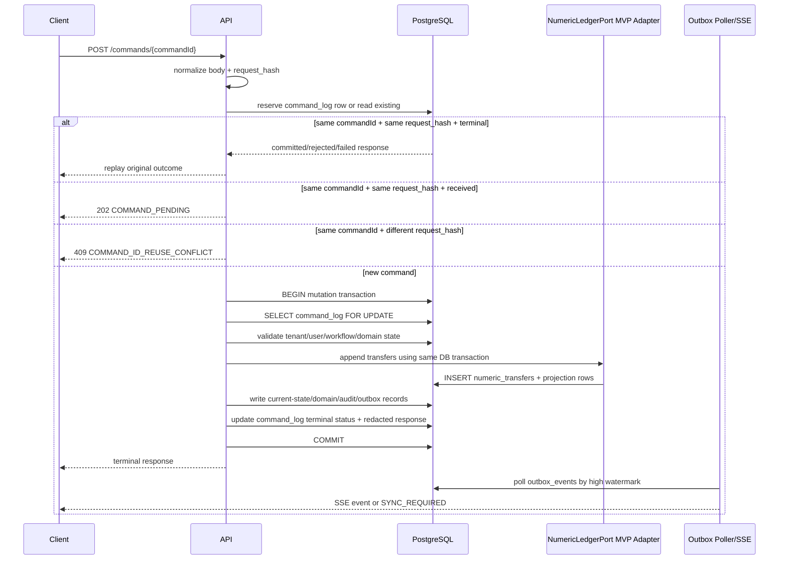
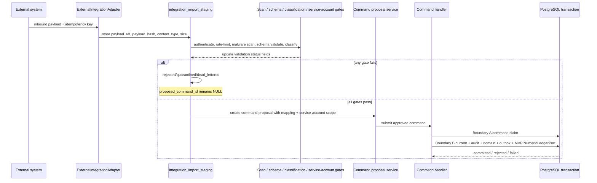

# Command Lifecycle

**Version:** 0.14.3  
**Last-reviewed:** 2026-06-26  
**Status:** Phase 0 implementation-readiness contract

## Purpose

Define the only safe mutation path for Phase 0 and the exact transaction boundary for the vertical slice.

## Normative behavior

All mutation commands use a client-supplied command ID, normalized request hash, durable `command_log`, and command status endpoint. Lost responses are recovered through status lookup; clients never blindly retry with a new command ID.

For MVP, `NumericLedgerPort` is implemented by `PostgresMvpNumericLedgerAdapter` and participates in the same PostgreSQL transaction as domain, audit, outbox, and terminal command status writes. TigerBeetle is not called from the Phase 0 command transaction.

## Core mutation transaction boundary



## Normative transaction sequence

1. **Ingress and normalization**
   - Validate authenticated tenant and user context.
   - Normalize the request body.
   - Compute `request_hash` and `request_body_hash` according to the command privacy contract.
   - Generate or propagate `trace_id` and `correlation_id`.

2. **Idempotency reservation**
   - Insert or select `command_log` for `(tenant_id, command_id)`.
   - Same `request_hash` with terminal status returns the original redacted/encrypted response.
   - Same `request_hash` with non-terminal `received` returns `202 COMMAND_PENDING`; it must not execute a second mutation.
   - Different `request_hash` returns `409 COMMAND_ID_REUSE_CONFLICT`.

3. **Single PostgreSQL mutation transaction**
   - Start one transaction for the domain mutation.
   - Lock the command row with `SELECT ... FOR UPDATE`.
   - Re-check idempotency status inside the transaction.
   - Validate permissions, workflow state, field policy, and domain state.
   - Call `NumericLedgerPort.appendTransfers(...)` only through the MVP PostgreSQL adapter.
   - Write current-state records, numeric transfers/projections, audit events, domain events, outbox events, and terminal `command_log` status.
   - Commit once.

4. **Response and recovery**
   - Return the terminal response after commit.
   - If the HTTP response is lost, the client recovers through `GET /commands/{commandId}`.
   - The command status endpoint never derives success from client retry behavior.

## Savepoint policy

Savepoints are allowed only for contained validation or projection substeps that can be rolled back before terminal rejection. They are **not** a partial-success mechanism.

Allowed:

```text
SAVEPOINT validate_numeric_preview;
  run validation query or provisional projection check;
ROLLBACK TO SAVEPOINT validate_numeric_preview;
continue with rejection or clean mutation path;
```

Prohibited:

```text
commit some edited rows, roll back other rows, and still mark one command committed
wrap external TigerBeetle calls in a PostgreSQL savepoint
use savepoints to hide partial domain mutation failure
```

Any command that reaches terminal `committed` must have a complete current-state/domain/audit/outbox/numeric-ledger correlation. Any command that fails validation must be terminal `rejected` with no partial domain mutation.

## Reference pseudocode

```ts
type CommandResult =
  | { status: 'committed'; response: unknown }
  | { status: 'rejected'; problem: unknown }
  | { status: 'failed'; problem: unknown }
  | { status: 'pending' };

async function executeCommand(ctx: RequestContext, body: unknown): Promise<CommandResult> {
  const normalized = normalizeCommandBody(body);
  const requestHash = hashNormalizedBody(normalized);

  const reservation = await commandLog.reserveOrRead({
    tenantId: ctx.tenantId,
    commandId: ctx.commandId,
    requestHash,
    traceId: ctx.traceId,
    correlationId: ctx.correlationId,
  });

  if (reservation.kind === 'terminal_same_hash') return reservation.originalResult;
  if (reservation.kind === 'pending_same_hash') return { status: 'pending' };
  if (reservation.kind === 'conflict_different_hash') throw commandIdReuseConflict();

  try {
    return await db.transaction(async (tx) => {
      const command = await commandLog.lockForUpdate(tx, ctx.tenantId, ctx.commandId);
      assertStillExecutable(command, requestHash);

      const authz = await permissionCompiler.assertCanMutate(tx, ctx, normalized);
      const domainPlan = await domainPlanner.plan(tx, ctx, normalized, authz);

      const ledgerResult = await numericLedgerPort.appendTransfers(tx, {
        tenantId: ctx.tenantId,
        commandId: ctx.commandId,
        movementGroupId: domainPlan.movementGroupId,
        transfers: domainPlan.numericTransfers,
      });

      const domainResult = await domainWriter.apply(tx, domainPlan, ledgerResult);
      await auditWriter.write(tx, ctx, domainResult);
      await domainEventWriter.write(tx, ctx, domainResult);
      await outboxWriter.write(tx, ctx, domainResult);

      const response = buildRedactedCommandResponse(domainResult);
      await commandLog.markCommitted(tx, ctx.tenantId, ctx.commandId, response);
      return { status: 'committed', response };
    });
  } catch (err) {
    if (isValidationOrPolicyError(err)) {
      await commandLog.tryMarkRejected(ctx.tenantId, ctx.commandId, problemFrom(err));
      return { status: 'rejected', problem: problemFrom(err) };
    }

    await commandLog.tryMarkFailed(ctx.tenantId, ctx.commandId, problemFrom(err));
    throw err;
  }
}
```

## Partial-failure recovery expectations

| Failure point | Required behavior |
|---|---|
| Validation/policy rejection before domain writes | Mark `rejected`; no domain/audit/outbox/numeric transfer rows except optional rejection audit if policy allows. |
| PostgreSQL transaction rolls back before commit | No domain/audit/outbox/numeric transfer rows survive; command row may remain `received` until failure marker or recovery job. |
| Transaction commits but HTTP response is lost | `GET /commands/{commandId}` returns terminal committed/rejected/failed result. |
| Command row is `received` beyond timeout and no correlated rows exist | Recovery marks `failed` or later TTL job marks `ambiguous` according to unknown-outcome policy. |
| Correlated audit/domain/outbox rows exist but command status is stale | Recovery repairs command terminal status from correlated records. |
| MVP `NumericLedgerPort` projection fails inside transaction | Whole command transaction rolls back; no partial committed numeric effect. |
| Post-MVP TigerBeetle succeeds but PostgreSQL projection write fails | Not possible in Phase 0. In P1 cutover, deterministic transfer IDs drive projection/outbox/command repair. |

## Required tests

- `ci://tests/e2e/TC-CMD-001-network-loss-after-commit`
- `ci://tests/api/command-status-ttl`
- `ci://tests/api/command-id-reuse-conflict`
- `ci://tests/command/transaction-boundary-atomicity`
- `ci://tests/command/mvp-ledger-port-in-same-pg-transaction`
- `ci://tests/command/savepoint-rejection-no-partial-domain-state`
- `ci://tests/command/recovery-repairs-stale-received-with-correlated-outbox`
- `ci://tests/command/transaction-boundary-atomic-current-audit-domain-outbox`
- `ci://tests/command/ledger-port-savepoint-recovery`

## Observability fields

- `trace_id`
- `correlation_id`
- `tenant_id_hash`
- `command_id`
- `command_type`
- `command_status`
- `request_hash_match`
- `duplicate_inflight`
- `audit_event_count`
- `domain_event_count`
- `outbox_event_count`
- `numeric_transfer_count`

## Owner role

API/Client Owner, with Backend/Domain Owner for mutation transaction semantics.

## Links

- `docs/gates/P0-CMD-001-command-identity-and-unknown-outcome.md`
- `docs/adr/ADR-0014-event-ready-boundary.md`
- `docs/slo-baseline.yml`
- `docs/data/numeric-ledger-contract.md`
- `docs/ops/failure-mode-recovery-playbooks.md`

## Implementation-readiness validation aliases

- Boundary A: command claim transaction.
- Boundary B: business mutation transaction.
- Implementations may name the MVP call `numericLedgerPort.postTransfers` or `numericLedgerPort.appendTransfers`; both refer to the same same-transaction NumericLedgerPort write.

## Implementation-readiness validation phrases

Boundary A: command claim transaction is the durable command reservation step.

Boundary B: business mutation transaction is the atomic mutation step.

The reference pseudo-code calls numericLedgerPort.postTransfers and confirms the MVP adapter participates in the same PostgreSQL transaction.

Savepoint policy is limited to ledger-domain rejection handling before domain writes.


---

## v0.14.3 integration staging to command handoff

External integration policies are canonical in `docs/data/external-integration-strategy-options.md` and `docs/data/external-integration-contract.md`. This section gives the command-lifecycle handoff only; it does not make adapters a mutation path.

Inbound integrations do not create business state. They create staged rows and, only after validation gates pass, command proposals. The command handler remains the only mutation boundary.



Normative gates before proposal creation:

```text
malware_scan_status == clean
schema_validation_status == valid
payload_size_bytes <= integration_connections.max_payload_bytes
content_type in integration_connections.allowed_content_types
credential_state in {current, rotating}
service_account scope allows object_type + proposed command_type
data_classification <= connection classification ceiling
external object mapping is resolved or explicitly staged as new mapping
```

Failure behavior:

| Failure | Behavior |
|---|---|
| Malware scan fails or times out | staging row moves to `quarantined`; no command proposal; security event emitted |
| Schema validation fails | staging row moves to `rejected`; no command proposal; validation error is redacted |
| Mapping conflict | staging row moves to `needs_mapping_review`; no command proposal |
| Same idempotency key, different payload hash | `INTEGRATION_IDEMPOTENCY_CONFLICT`; no duplicate business effect |
| Service-account scope denied | staging row moves to `rejected`; audit event includes service account and scope reason |
| Credential revoked after staging but before proposal | proposal is blocked; staging row remains repairable after credential owner action |
| Command proposal accepted but command handler rejects domain rule | staging row links to rejected command outcome; adapter does not retry with a new command ID |

Partial rollback rule: integration staging status changes are not rolled back merely because a later command proposal is rejected. The staged payload remains audit/replay evidence. Domain state changes only occur inside the command handler boundary.

Savepoints are allowed inside Boundary B only for optional diagnostic writes. They must not be used to hide failure of current-state, audit, domain event, outbox, command status, or `PostgresMvpNumericLedgerAdapter` writes.
