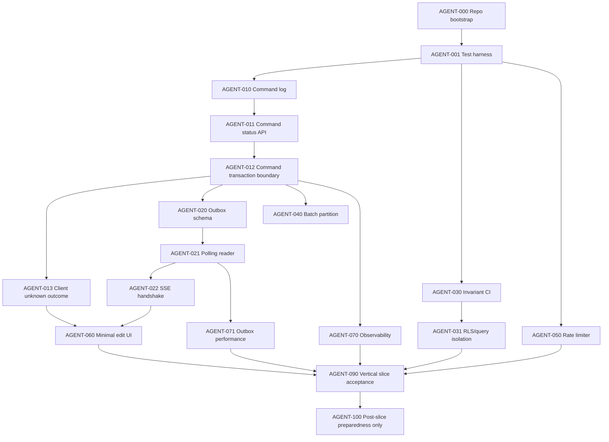
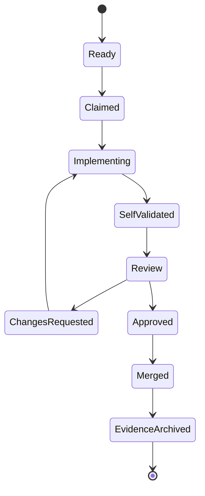

# AI Agent Implementation Roadmap Diagrams

**Version:** 0.17.0  
**Last-reviewed:** 2026-06-26  
**Status:** Active reference diagrams

## Phase 0 agent execution DAG

```mermaid
flowchart TD
    A[AGENT-000 Repo bootstrap] --> B[AGENT-001 Test harness]
    B --> C[AGENT-010 Command log]
    C --> D[AGENT-011 Command status API]
    D --> E[AGENT-012 Command transaction boundary]
    E --> F[AGENT-013 Client unknown outcome]
    E --> G[AGENT-020 Outbox schema]
    G --> H[AGENT-021 Polling reader]
    H --> I[AGENT-022 SSE handshake]
    F --> J[AGENT-060 Minimal edit UI]
    I --> J
    B --> K[AGENT-030 Invariant CI]
    K --> L[AGENT-031 RLS/query isolation]
    E --> M[AGENT-040 Batch partition]
    B --> N[AGENT-050 Rate limiter]
    E --> O[AGENT-070 Observability]
    H --> P[AGENT-071 Outbox performance]
    J --> Q[AGENT-090 Vertical slice acceptance]
    L --> Q
    N --> Q
    O --> Q
    P --> Q
    Q --> R[AGENT-100 Post-slice preparedness only]
```

## Agent PR lifecycle

```mermaid
stateDiagram-v2
    [*] --> Ready
    Ready --> Claimed
    Claimed --> Implementing
    Implementing --> SelfValidated
    SelfValidated --> Review
    Review --> ChangesRequested
    ChangesRequested --> Implementing
    Review --> Approved
    Approved --> Merged
    Merged --> EvidenceArchived
    EvidenceArchived --> [*]
```
