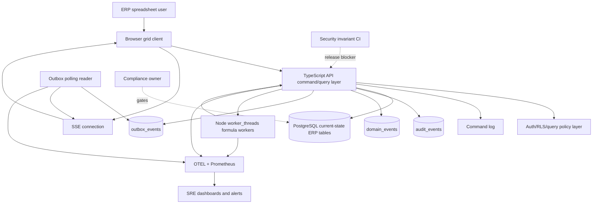
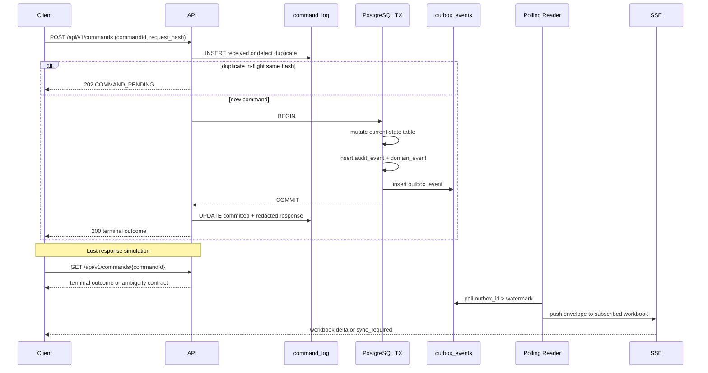

# Architecture Context Diagrams

## C4-style context

## Vertical slice timeline

## Component boundary rules

| Boundary | Rule |
|---|---|
| Browser -> API | Mutations use command identity; no blind retry after ambiguity. |
| API -> PostgreSQL | Current, audit, domain, and outbox writes share one business transaction. |
| Outbox -> SSE | Polling is durable path; `NOTIFY` is wake-up only after benchmark admission. |
| API -> command_log | Store hashes, trace context, redacted responses, and terminal status. |
| API -> formula workers | Resident graph and delta messages only; no full graph clone per edit. |
| CI -> release | Release-blocking invariants must map to executable evidence. |
