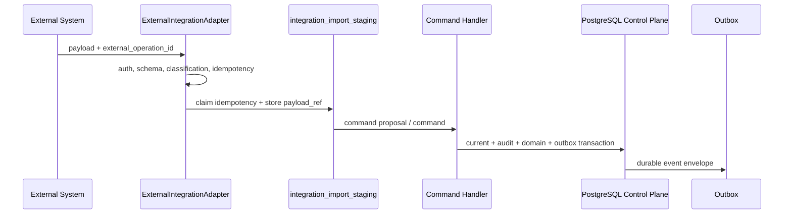
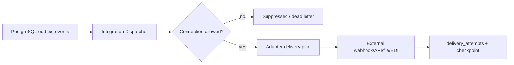
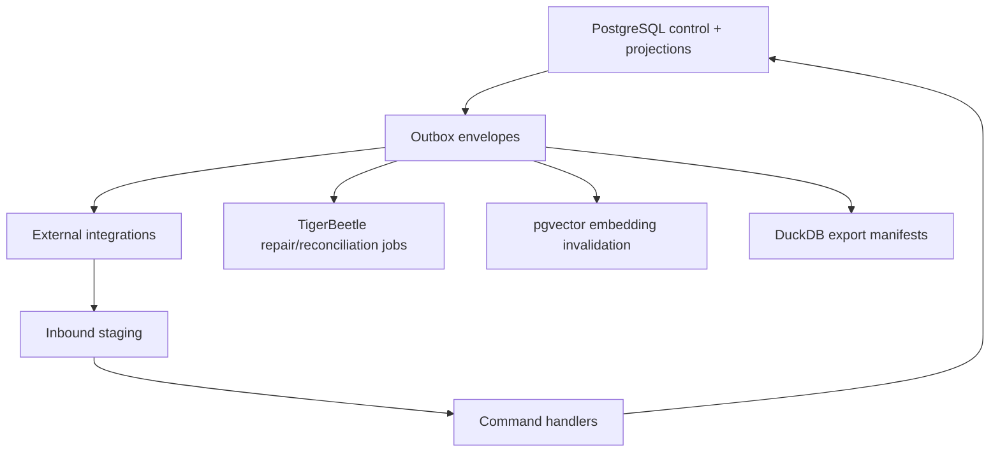

# External Integration and Post-MVP Planes

**Version:** 0.14

## Inbound integration

```mermaid
sequenceDiagram
    participant Ext as External System
    participant Adapter as ExternalIntegrationAdapter
    participant Stage as integration_import_staging
    participant Cmd as Command Handler
    participant PG as PostgreSQL Control Plane
    participant Outbox as Outbox
    Ext->>Adapter: payload + external_operation_id
    Adapter->>Adapter: auth, schema, classification, idempotency
    Adapter->>Stage: claim idempotency + store payload_ref
    Stage->>Cmd: command proposal / command
    Cmd->>PG: current + audit + domain + outbox transaction
    PG->>Outbox: durable event envelope
```

## Outbound integration

```mermaid
flowchart LR
    A[PostgreSQL outbox_events] --> B[Integration Dispatcher]
    B --> C{Connection allowed?}
    C -- no --> D[Suppressed / dead letter]
    C -- yes --> E[Adapter delivery plan]
    E --> F[External webhook/API/file/EDI]
    F --> G[delivery_attempts + checkpoint]
```

## Post-MVP plane synergy

```mermaid
flowchart TD
    PG[PostgreSQL control + projections] --> OUT[Outbox envelopes]
    OUT --> INT[External integrations]
    OUT --> TB[TigerBeetle repair/reconciliation jobs]
    OUT --> AI[pgvector embedding invalidation]
    OUT --> DUCK[DuckDB export manifests]
    INT --> STAGE[Inbound staging]
    STAGE --> CMD[Command handlers]
    CMD --> PG
```
