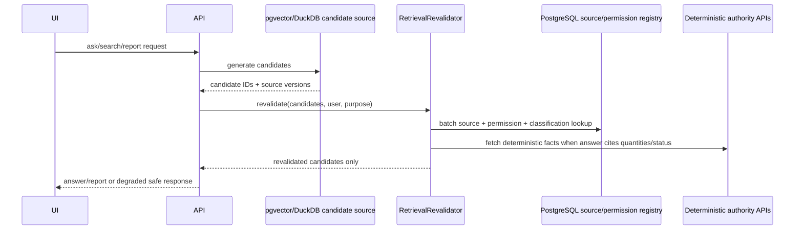
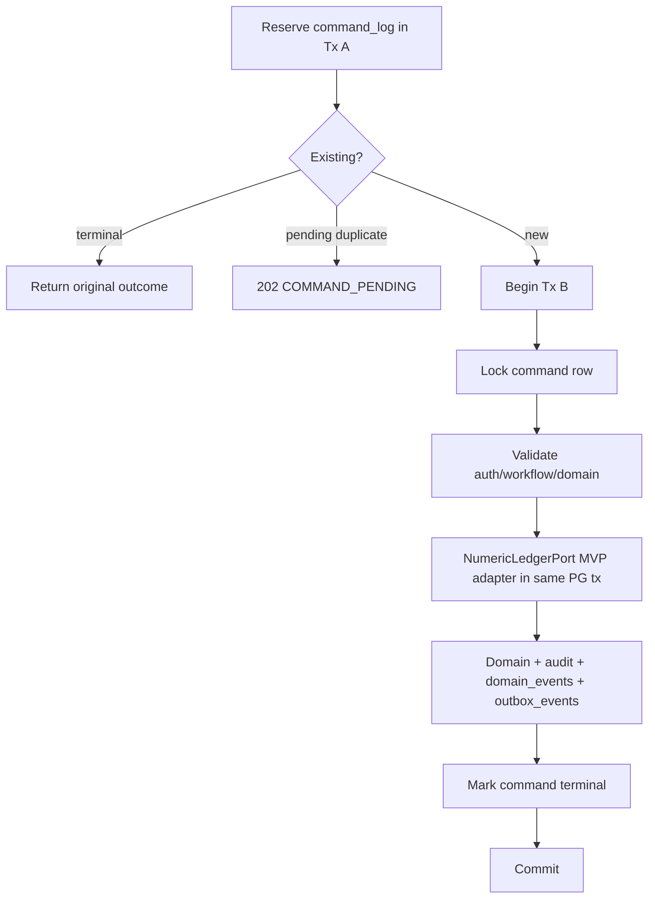

# v0.13.3 Implementation Readiness Diagrams

## Retrieval revalidation flow

```mermaid
sequenceDiagram
    participant UI
    participant API
    participant Candidate as pgvector/DuckDB candidate source
    participant Reval as RetrievalRevalidator
    participant PG as PostgreSQL source/permission registry
    participant Auth as Deterministic authority APIs

    UI->>API: ask/search/report request
    API->>Candidate: generate candidates
    Candidate-->>API: candidate IDs + source versions
    API->>Reval: revalidate(candidates, user, purpose)
    Reval->>PG: batch source + permission + classification lookup
    Reval->>Auth: fetch deterministic facts when answer cites quantities/status
    Reval-->>API: revalidated candidates only
    API-->>UI: answer/report or degraded safe response
```

## Command mutation boundary

```mermaid
flowchart TD
    A[Reserve command_log in Tx A] --> B{Existing?}
    B -- terminal --> C[Return original outcome]
    B -- pending duplicate --> D[202 COMMAND_PENDING]
    B -- new --> E[Begin Tx B]
    E --> F[Lock command row]
    F --> G[Validate auth/workflow/domain]
    G --> H[NumericLedgerPort MVP adapter in same PG tx]
    H --> I[Domain + audit + domain_events + outbox_events]
    I --> J[Mark command terminal]
    J --> K[Commit]
```
