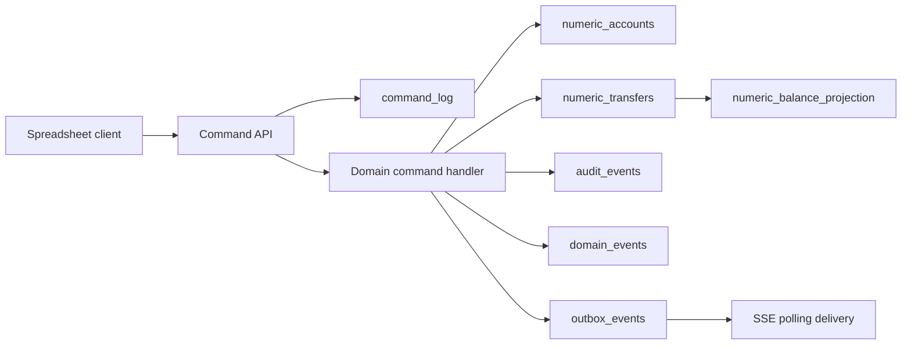
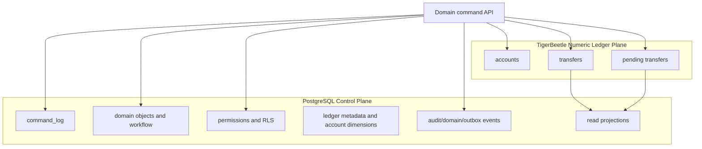
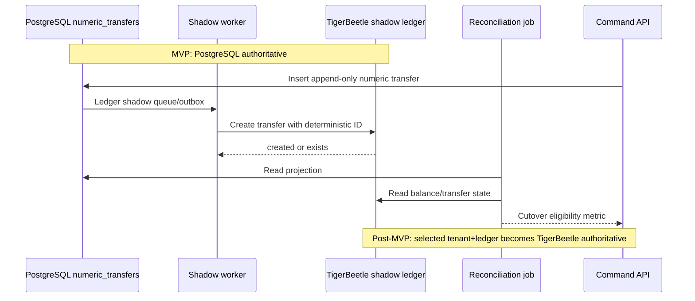

# Ledger Plane and Migration Diagrams

This file restores the v0.12.4 ledger-plane diagrams and points to the newer canonical numeric-ledger diagrams in `docs/diagrams/numeric-ledger-plane.md`.

## MVP ledger-ready numeric flow

## Post-MVP target boundary

## Migration lifecycle

