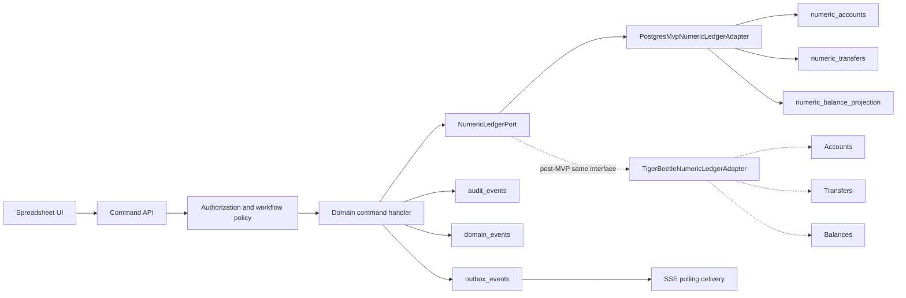
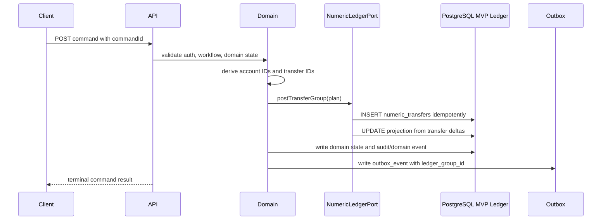
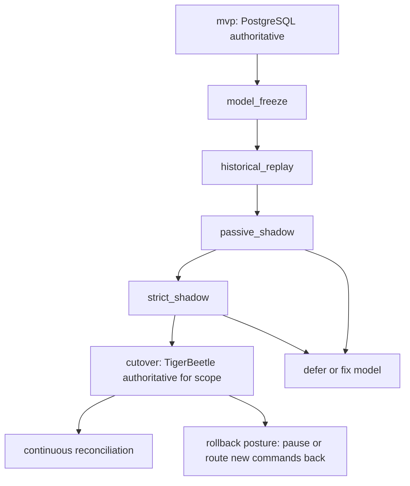
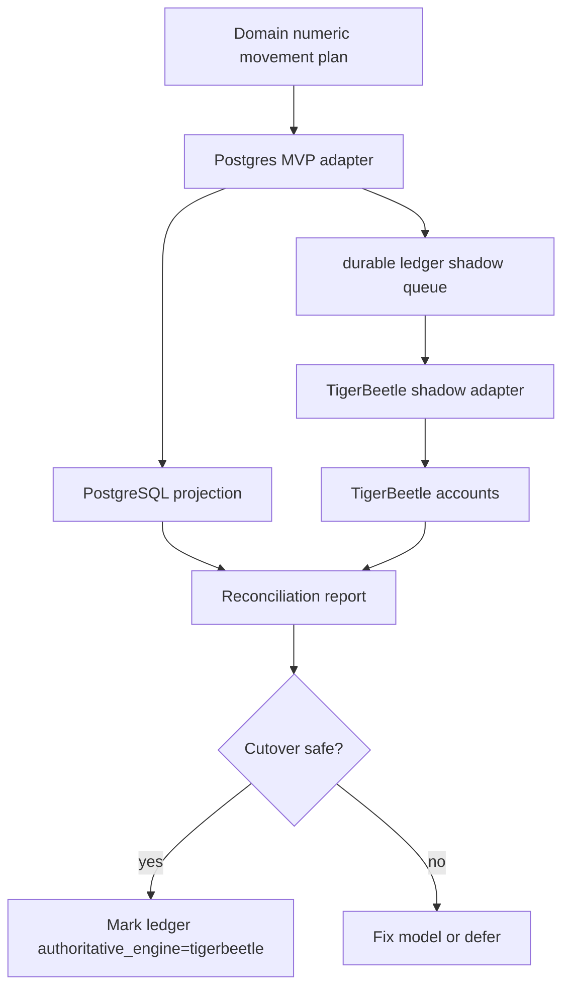
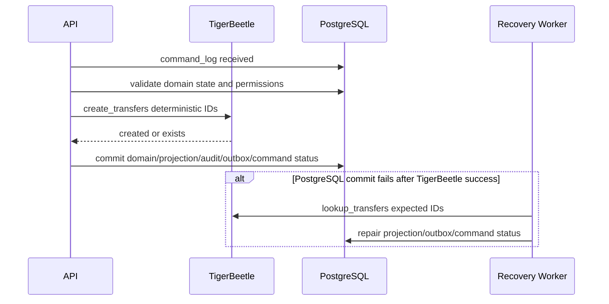

# Numeric Ledger Plane Diagrams

## MVP to post-MVP boundary

## Numeric command sequence in MVP

## Post-MVP migration stages

## Passive and strict shadow mode

## Post-cutover recovery path

