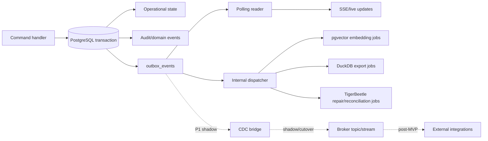
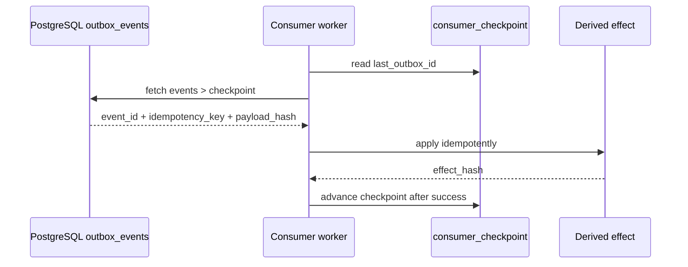

# Outbox Fan-out and Derived Planes

## MVP and post-MVP fan-out path

```mermaid
flowchart LR
    C[Command handler] --> TX[(PostgreSQL transaction)]
    TX --> S[Operational state]
    TX --> A[Audit/domain events]
    TX --> O[outbox_events]
    O --> P[Polling reader]
    P --> SSE[SSE/live updates]
    O --> D[Internal dispatcher]
    D --> SEM[pgvector embedding jobs]
    D --> AN[DuckDB export jobs]
    D --> LED[TigerBeetle repair/reconciliation jobs]
    O -. P1 shadow .-> CDC[CDC bridge]
    CDC -. shadow/cutover .-> B[Broker topic/stream]
    B -. post-MVP .-> EXT[External integrations]
```

## Consumer checkpoint and idempotency

```mermaid
sequenceDiagram
    participant O as PostgreSQL outbox_events
    participant W as Consumer worker
    participant C as consumer_checkpoint
    participant E as Derived effect

    W->>C: read last_outbox_id
    W->>O: fetch events > checkpoint
    O-->>W: event_id + idempotency_key + payload_hash
    W->>E: apply idempotently
    E-->>W: effect_hash
    W->>C: advance checkpoint after success
```
