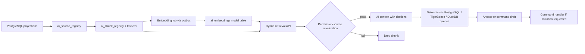
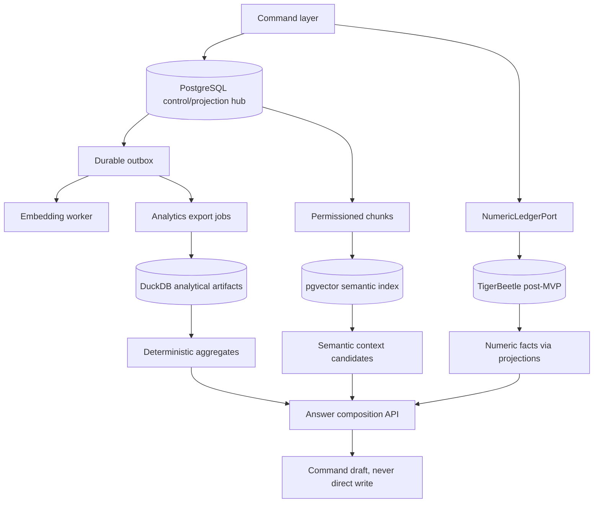

# pgvector Semantic Plane Diagrams

## Permissioned semantic retrieval flow

```mermaid
flowchart LR
    A[PostgreSQL projections] --> B[ai_source_registry]
    B --> C[ai_chunk_registry + tsvector]
    C --> D[Embedding job via outbox]
    D --> E[ai_embeddings model table]
    E --> F[Hybrid retrieval API]
    C --> F
    F --> G{Permission/source revalidation}
    G -- pass --> H[AI context with citations]
    G -- fail --> I[Drop chunk]
    H --> J[Deterministic PostgreSQL / TigerBeetle / DuckDB queries]
    J --> K[Answer or command draft]
    K --> L[Command handler if mutation requested]
```

## Integration with specialized planes

```mermaid
flowchart TB
    CMD[Command layer] --> PG[(PostgreSQL control/projection hub)]
    PG --> OUT[Durable outbox]
    OUT --> EMB[Embedding worker]
    PG --> SRC[Permissioned chunks]
    SRC --> PGV[(pgvector semantic index)]
    OUT --> EXP[Analytics export jobs]
    EXP --> DDB[(DuckDB analytical artifacts)]
    CMD --> NLG[NumericLedgerPort]
    NLG --> TB[(TigerBeetle post-MVP)]
    PGV --> CTX[Semantic context candidates]
    DDB --> AGG[Deterministic aggregates]
    TB --> NUM[Numeric facts via projections]
    CTX --> API[Answer composition API]
    AGG --> API
    NUM --> API
    API --> CMD2[Command draft, never direct write]
```
