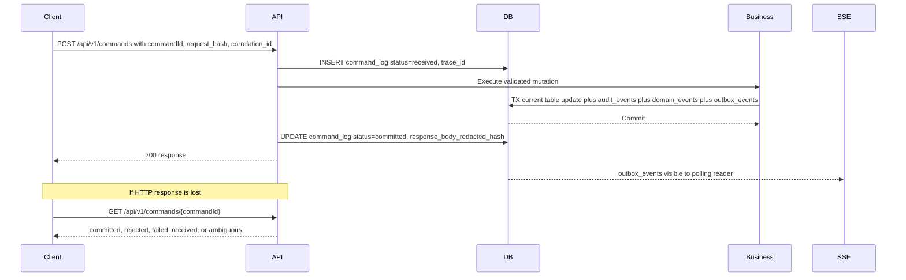
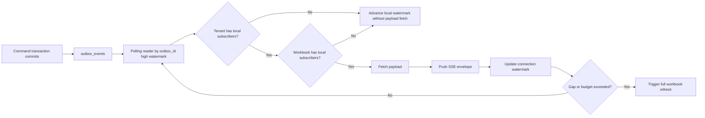
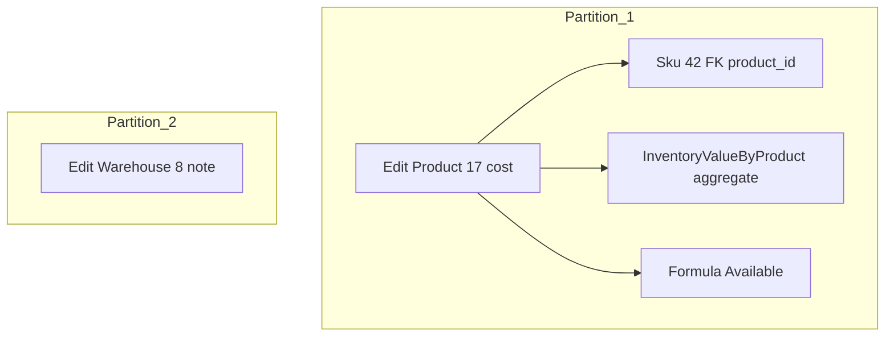
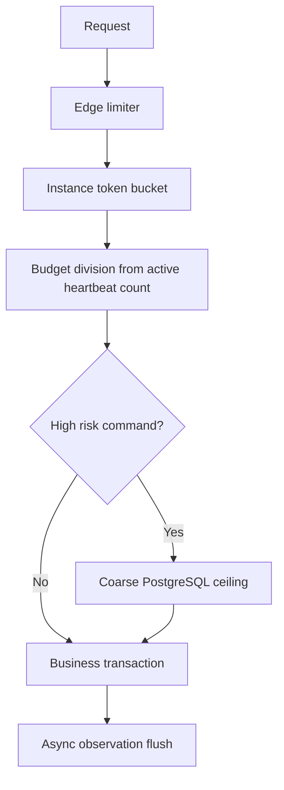

# Phase 0 Flow Diagrams

**Version:** 0.13  
**Last-reviewed:** 2026-06-26

## Command lifecycle

## Outbox polling and demand filtering

## Batch partition graph example

## Rate limiter layers

## See also

- `docs/diagrams/architecture-context.md` for C4-style architecture and vertical-slice sequence.
