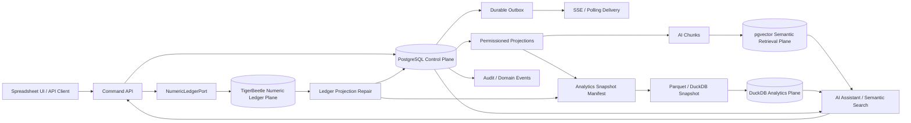
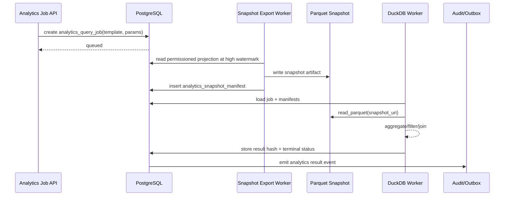
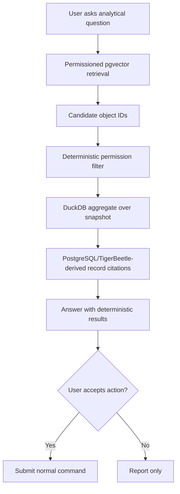

# Post-MVP Data Plane Synergy Diagrams

## Specialized plane context

```mermaid
flowchart LR
    Client[Spreadsheet UI / API Client] --> API[Command API]
    API --> PG[(PostgreSQL Control Plane)]
    PG --> OUT[Durable Outbox]
    OUT --> SSE[SSE / Polling Delivery]

    PG --> PROJ[Permissioned Projections]
    PG --> AUD[Audit / Domain Events]

    API --> NLP[NumericLedgerPort]
    NLP --> TB[(TigerBeetle Numeric Ledger Plane)]
    TB --> LPROJ[Ledger Projection Repair]
    LPROJ --> PG

    PROJ --> AI_CHUNKS[AI Chunks]
    AI_CHUNKS --> PGV[(pgvector Semantic Retrieval Plane)]

    PROJ --> SNAP[Analytics Snapshot Manifest]
    LPROJ --> SNAP
    SNAP --> PQ[Parquet / DuckDB Snapshot]
    PQ --> DDB[(DuckDB Analytics Plane)]

    PGV --> ASSIST[AI Assistant / Semantic Search]
    DDB --> ASSIST
    PG --> ASSIST
    ASSIST --> API
```

## DuckDB snapshot job

```mermaid
sequenceDiagram
    participant Job as Analytics Job API
    participant PG as PostgreSQL
    participant Export as Snapshot Export Worker
    participant File as Parquet Snapshot
    participant DDB as DuckDB Worker
    participant Audit as Audit/Outbox

    Job->>PG: create analytics_query_job(template, params)
    PG-->>Job: queued
    Export->>PG: read permissioned projection at high watermark
    Export->>File: write snapshot artifact
    Export->>PG: insert analytics_snapshot_manifest
    DDB->>PG: load job + manifests
    DDB->>File: read_parquet(snapshot_uri)
    DDB-->>DDB: aggregate/filter/join
    DDB->>PG: store result hash + terminal status
    PG->>Audit: emit analytics result event
```

## AI + DuckDB deterministic answer pattern

```mermaid
flowchart TD
    Q[User asks analytical question] --> R[Permissioned pgvector retrieval]
    R --> C[Candidate object IDs]
    C --> F[Deterministic permission filter]
    F --> D[DuckDB aggregate over snapshot]
    D --> P[PostgreSQL/TigerBeetle-derived record citations]
    P --> A[Answer with deterministic results]
    A --> CMD{User accepts action?}
    CMD -- Yes --> API[Submit normal command]
    CMD -- No --> END[Report only]
```
