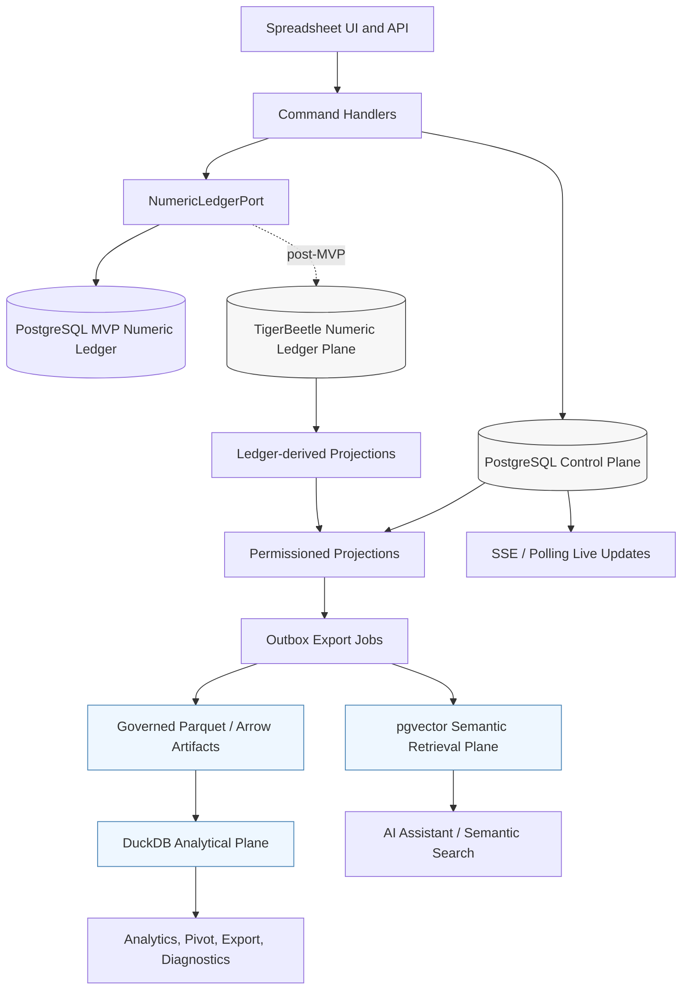
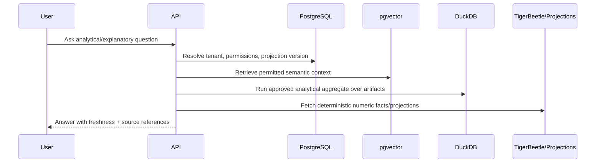
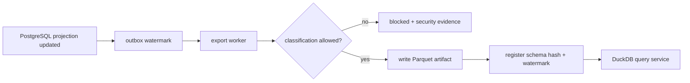

# Post-MVP Data Planes

## Component context

```mermaid
flowchart TB
    UI[Spreadsheet UI and API] --> CMD[Command Handlers]
    CMD --> PG[(PostgreSQL Control Plane)]
    CMD --> NLP[NumericLedgerPort]
    NLP --> PGN[(PostgreSQL MVP Numeric Ledger)]
    NLP -. post-MVP .-> TB[(TigerBeetle Numeric Ledger Plane)]

    PG --> PROJ[Permissioned Projections]
    TB --> LEDGERPROJ[Ledger-derived Projections]
    LEDGERPROJ --> PROJ

    PROJ --> OUTBOX[Outbox Export Jobs]
    OUTBOX --> AI[pgvector Semantic Retrieval Plane]
    OUTBOX --> ART[Governed Parquet / Arrow Artifacts]
    ART --> DUCK[DuckDB Analytical Plane]

    AI --> ASSIST[AI Assistant / Semantic Search]
    DUCK --> ANALYTICS[Analytics, Pivot, Export, Diagnostics]
    PG --> SSE[SSE / Polling Live Updates]

    classDef source fill:#f7f7f7,stroke:#444;
    classDef derived fill:#eef7ff,stroke:#4682b4;
    class PG,TB source;
    class AI,DUCK,ART derived;
```

## Query choreography

```mermaid
sequenceDiagram
    participant User
    participant API
    participant PG as PostgreSQL
    participant V as pgvector
    participant D as DuckDB
    participant T as TigerBeetle/Projections

    User->>API: Ask analytical/explanatory question
    API->>PG: Resolve tenant, permissions, projection version
    API->>V: Retrieve permitted semantic context
    API->>D: Run approved analytical aggregate over artifacts
    API->>T: Fetch deterministic numeric facts/projections
    API-->>User: Answer with freshness + source references
```

## Artifact export path

```mermaid
flowchart LR
    A[PostgreSQL projection updated] --> B[outbox watermark]
    B --> C[export worker]
    C --> D{classification allowed?}
    D -- no --> E[blocked + security evidence]
    D -- yes --> F[write Parquet artifact]
    F --> G[register schema hash + watermark]
    G --> H[DuckDB query service]
```
