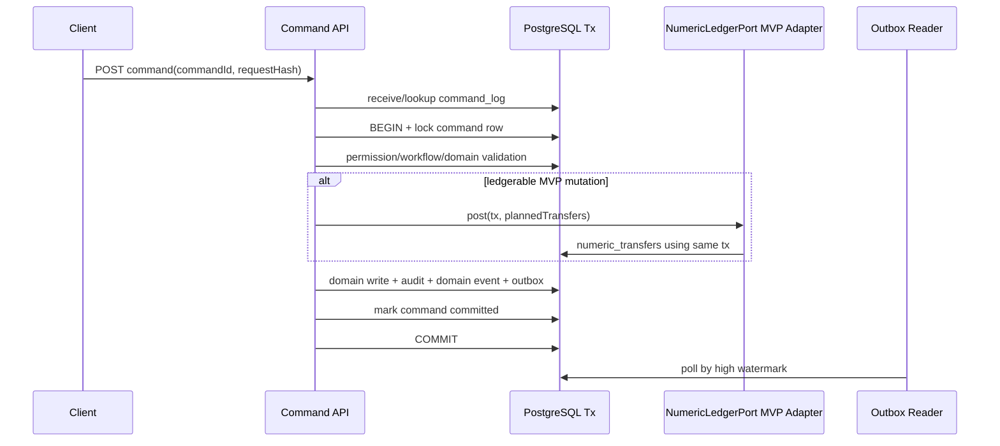
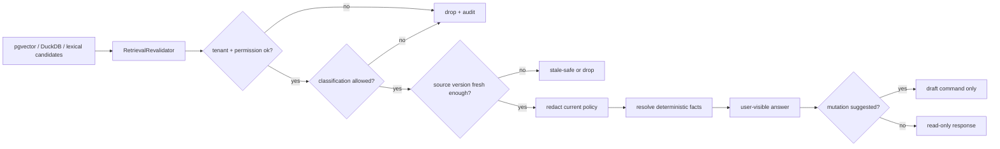
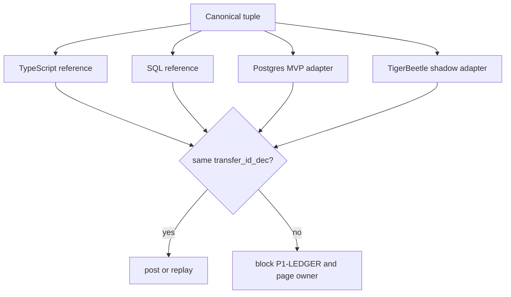

# Retrieval Revalidator and Command Boundary Diagrams

## Command mutation boundary

```mermaid
sequenceDiagram
    participant Client
    participant API as Command API
    participant DB as PostgreSQL Tx
    participant Ledger as NumericLedgerPort MVP Adapter
    participant Outbox as Outbox Reader

    Client->>API: POST command(commandId, requestHash)
    API->>DB: receive/lookup command_log
    API->>DB: BEGIN + lock command row
    API->>DB: permission/workflow/domain validation
    alt ledgerable MVP mutation
      API->>Ledger: post(tx, plannedTransfers)
      Ledger->>DB: numeric_transfers using same tx
    end
    API->>DB: domain write + audit + domain event + outbox
    API->>DB: mark command committed
    API->>DB: COMMIT
    Outbox->>DB: poll by high watermark
```

## Retrieval revalidation flow

```mermaid
flowchart LR
    A[pgvector / DuckDB / lexical candidates] --> B[RetrievalRevalidator]
    B --> C{tenant + permission ok?}
    C -- no --> X[drop + audit]
    C -- yes --> D{classification allowed?}
    D -- no --> X
    D -- yes --> E{source version fresh enough?}
    E -- no --> Y[stale-safe or drop]
    E -- yes --> F[redact current policy]
    F --> G[resolve deterministic facts]
    G --> H[user-visible answer]
    H --> I{mutation suggested?}
    I -- yes --> J[draft command only]
    I -- no --> K[read-only response]
```

## Ledger ID parity flow

```mermaid
flowchart TD
    A[Canonical tuple] --> B[TypeScript reference]
    A --> C[SQL reference]
    A --> D[Postgres MVP adapter]
    A --> E[TigerBeetle shadow adapter]
    B --> F{same transfer_id_dec?}
    C --> F
    D --> F
    E --> F
    F -- yes --> G[post or replay]
    F -- no --> H[block P1-LEDGER and page owner]
```
