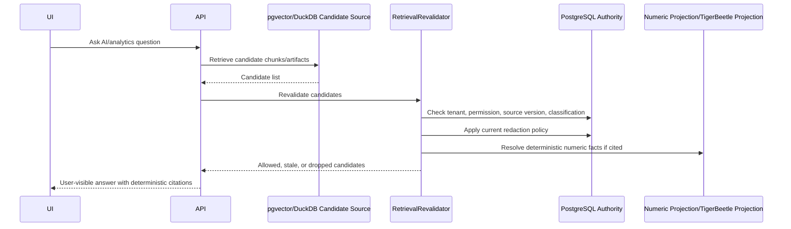
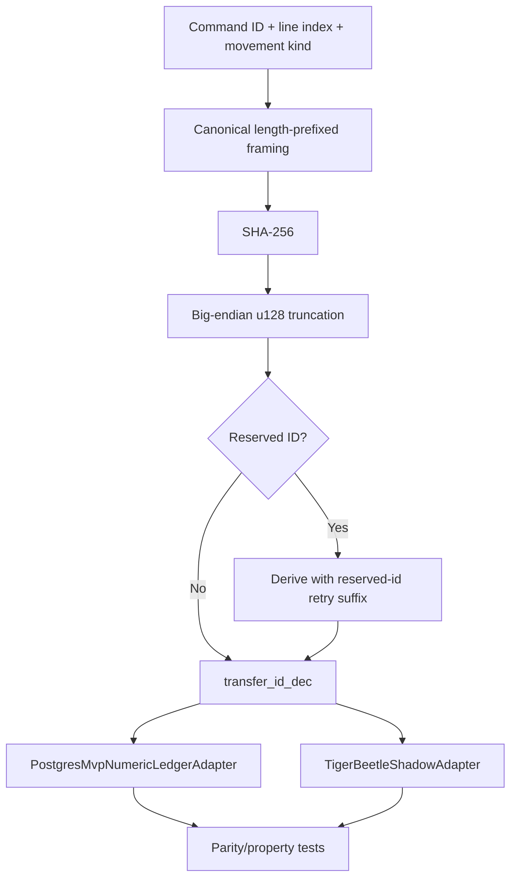
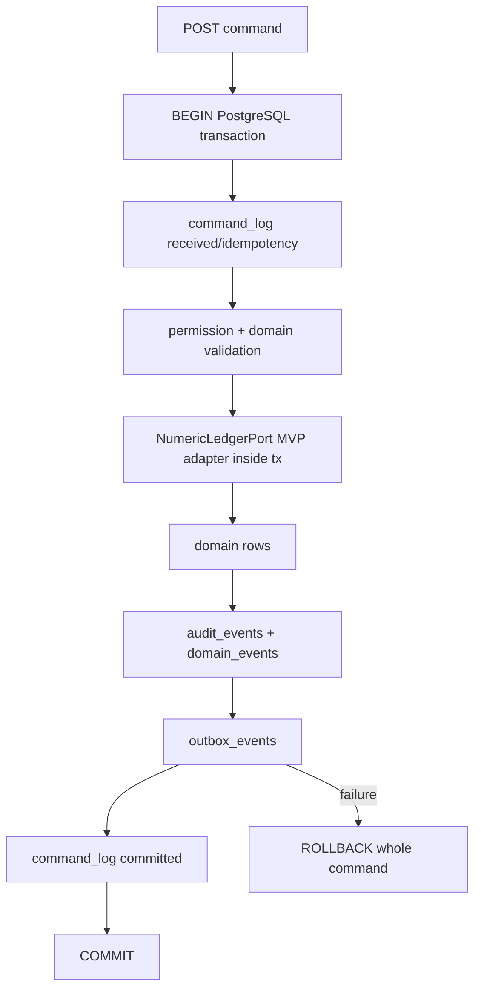

# Revalidation and Ledger ID Flows

## RetrievalRevalidator sequence

```mermaid
sequenceDiagram
    participant UI
    participant API
    participant Search as pgvector/DuckDB Candidate Source
    participant Reval as RetrievalRevalidator
    participant PG as PostgreSQL Authority
    participant Ledger as Numeric Projection/TigerBeetle Projection
    UI->>API: Ask AI/analytics question
    API->>Search: Retrieve candidate chunks/artifacts
    Search-->>API: Candidate list
    API->>Reval: Revalidate candidates
    Reval->>PG: Check tenant, permission, source version, classification
    Reval->>PG: Apply current redaction policy
    Reval->>Ledger: Resolve deterministic numeric facts if cited
    Reval-->>API: Allowed, stale, or dropped candidates
    API-->>UI: User-visible answer with deterministic citations
```

## Ledger ID derivation flow

```mermaid
flowchart TD
    A[Command ID + line index + movement kind] --> B[Canonical length-prefixed framing]
    B --> C[SHA-256]
    C --> D[Big-endian u128 truncation]
    D --> E{Reserved ID?}
    E -- Yes --> F[Derive with reserved-id retry suffix]
    E -- No --> G[transfer_id_dec]
    F --> G
    G --> H[PostgresMvpNumericLedgerAdapter]
    G --> I[TigerBeetleShadowAdapter]
    H --> J[Parity/property tests]
    I --> J
```

## Command transaction boundary

```mermaid
flowchart TD
    A[POST command] --> B[BEGIN PostgreSQL transaction]
    B --> C[command_log received/idempotency]
    C --> D[permission + domain validation]
    D --> E[NumericLedgerPort MVP adapter inside tx]
    E --> F[domain rows]
    F --> G[audit_events + domain_events]
    G --> H[outbox_events]
    H --> I[command_log committed]
    I --> J[COMMIT]
    H -- failure --> K[ROLLBACK whole command]
```
