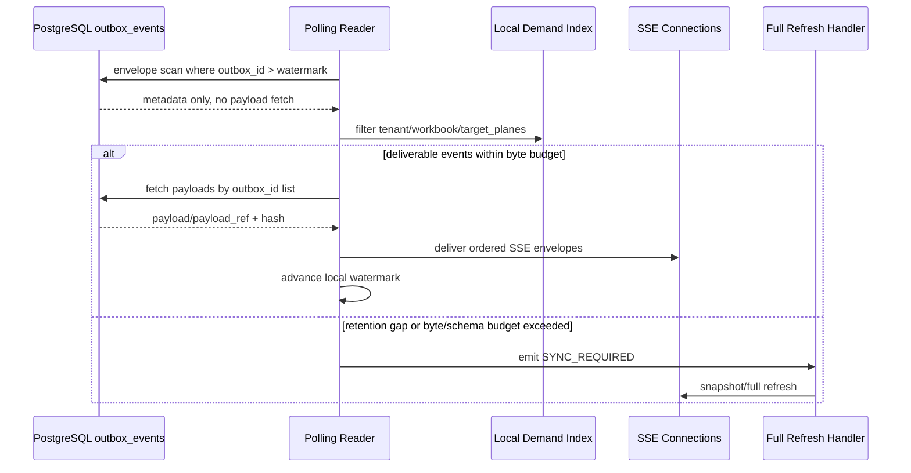
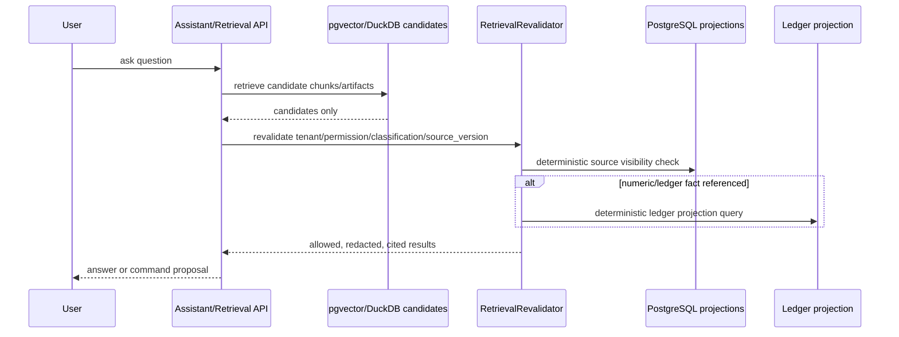
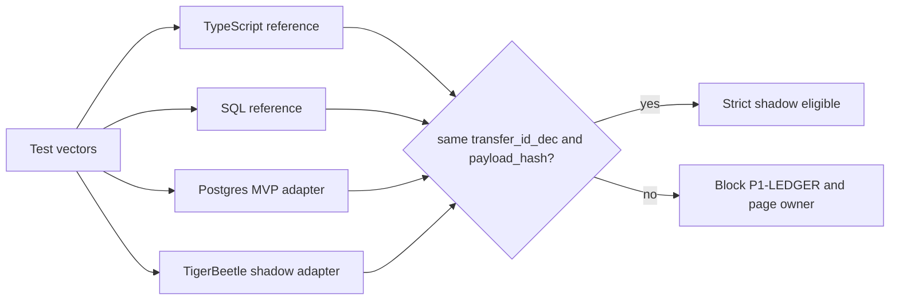

# v0.13.2 Review-Closure Diagrams

## Outbox polling under mixed target planes

```mermaid
sequenceDiagram
    participant DB as PostgreSQL outbox_events
    participant P as Polling Reader
    participant D as Local Demand Index
    participant S as SSE Connections
    participant R as Full Refresh Handler

    P->>DB: envelope scan where outbox_id > watermark
    DB-->>P: metadata only, no payload fetch
    P->>D: filter tenant/workbook/target_planes
    alt deliverable events within byte budget
        P->>DB: fetch payloads by outbox_id list
        DB-->>P: payload/payload_ref + hash
        P->>S: deliver ordered SSE envelopes
        P->>P: advance local watermark
    else retention gap or byte/schema budget exceeded
        P->>R: emit SYNC_REQUIRED
        R->>S: snapshot/full refresh
    end
```

## RetrievalRevalidator before user-visible answers

```mermaid
sequenceDiagram
    participant U as User
    participant A as Assistant/Retrieval API
    participant V as pgvector/DuckDB candidates
    participant R as RetrievalRevalidator
    participant PG as PostgreSQL projections
    participant L as Ledger projection

    U->>A: ask question
    A->>V: retrieve candidate chunks/artifacts
    V-->>A: candidates only
    A->>R: revalidate tenant/permission/classification/source_version
    R->>PG: deterministic source visibility check
    alt numeric/ledger fact referenced
        R->>L: deterministic ledger projection query
    end
    R-->>A: allowed, redacted, cited results
    A-->>U: answer or command proposal
```

## Ledger ID parity before strict shadow

```mermaid
flowchart LR
    T[Test vectors] --> TS[TypeScript reference]
    T --> SQL[SQL reference]
    T --> PG[Postgres MVP adapter]
    T --> TB[TigerBeetle shadow adapter]
    TS --> P{same transfer_id_dec and payload_hash?}
    SQL --> P
    PG --> P
    TB --> P
    P -- yes --> S[Strict shadow eligible]
    P -- no --> B[Block P1-LEDGER and page owner]
```
