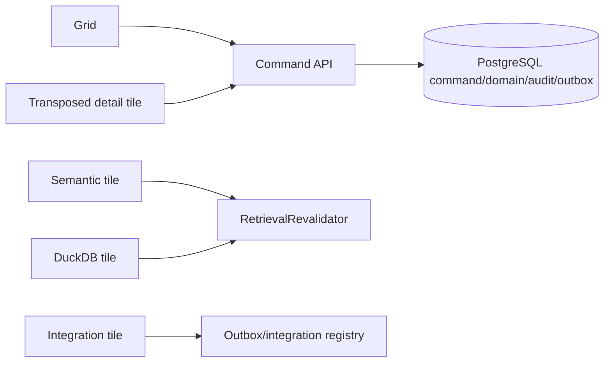

# Tiled Workspace UI

```mermaid
flowchart LR
  Grid[Grid] --> Cmd[Command API]
  Transpose[Transposed detail tile] --> Cmd
  Search[Semantic tile] --> Reval[RetrievalRevalidator]
  Analytics[DuckDB tile] --> Reval
  Integration[Integration tile] --> Outbox[Outbox/integration registry]
  Cmd --> PG[(PostgreSQL command/domain/audit/outbox)]
```
