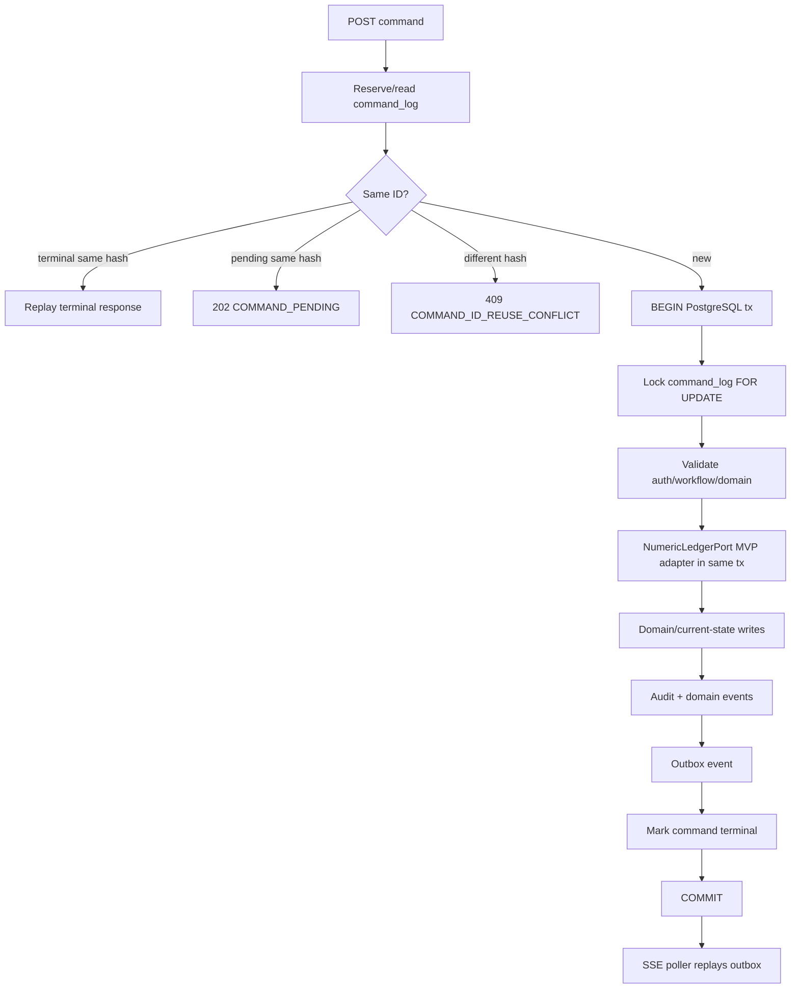
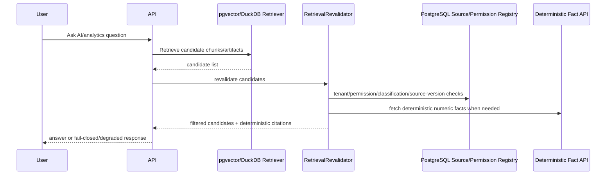
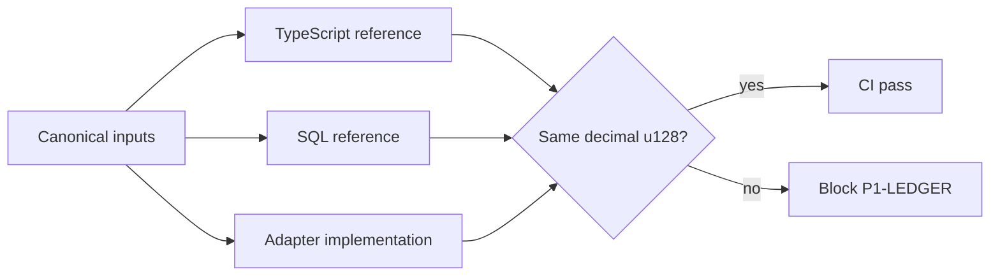

# v0.13.3 Implementation Flows

**Version:** 0.13.3  
**Last-reviewed:** 2026-06-26

## Command transaction boundary

```mermaid
flowchart TD
    A[POST command] --> B[Reserve/read command_log]
    B --> C{Same ID?}
    C -- terminal same hash --> R[Replay terminal response]
    C -- pending same hash --> P[202 COMMAND_PENDING]
    C -- different hash --> X[409 COMMAND_ID_REUSE_CONFLICT]
    C -- new --> T[BEGIN PostgreSQL tx]
    T --> L[Lock command_log FOR UPDATE]
    L --> V[Validate auth/workflow/domain]
    V --> N[NumericLedgerPort MVP adapter in same tx]
    N --> D[Domain/current-state writes]
    D --> E[Audit + domain events]
    E --> O[Outbox event]
    O --> M[Mark command terminal]
    M --> K[COMMIT]
    K --> S[SSE poller replays outbox]
```

## RetrievalRevalidator middleware

```mermaid
sequenceDiagram
    participant User
    participant API
    participant Retriever as pgvector/DuckDB Retriever
    participant Reval as RetrievalRevalidator
    participant Source as PostgreSQL Source/Permission Registry
    participant Fact as Deterministic Fact API

    User->>API: Ask AI/analytics question
    API->>Retriever: Retrieve candidate chunks/artifacts
    Retriever-->>API: candidate list
    API->>Reval: revalidate candidates
    Reval->>Source: tenant/permission/classification/source-version checks
    Reval->>Fact: fetch deterministic numeric facts when needed
    Reval-->>API: filtered candidates + deterministic citations
    API-->>User: answer or fail-closed/degraded response
```

## Ledger ID derivation parity

```mermaid
flowchart LR
    I[Canonical inputs] --> TS[TypeScript reference]
    I --> SQL[SQL reference]
    I --> AD[Adapter implementation]
    TS --> P{Same decimal u128?}
    SQL --> P
    AD --> P
    P -- yes --> OK[CI pass]
    P -- no --> FAIL[Block P1-LEDGER]
```
