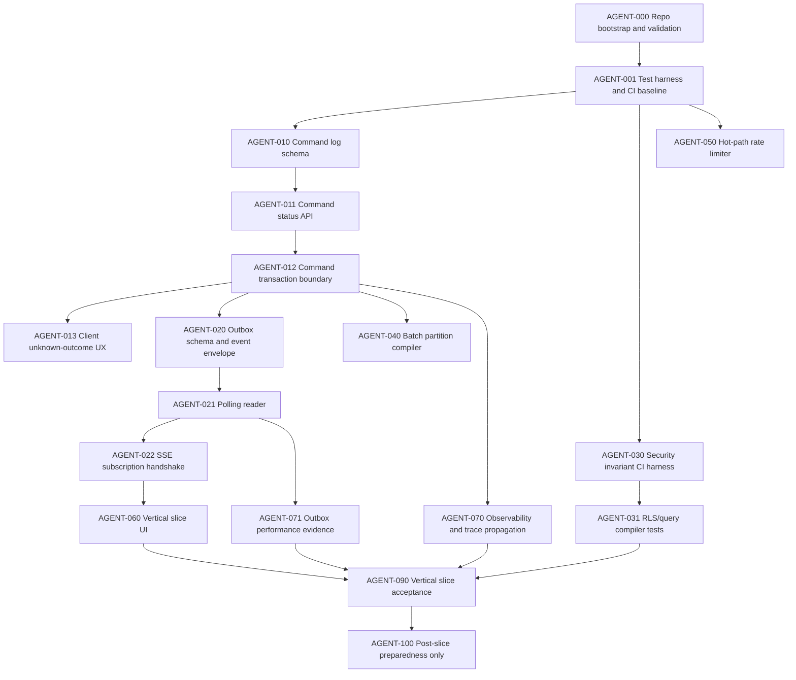

# AI Coding Agent Implementation Roadmap

**Version:** 0.16.1  
**Last-reviewed:** 2026-06-26  
**Status:** Active execution roadmap  
**Audience:** AI coding agents, reviewer agents, human owners, implementation leads

## 1. Purpose

This roadmap turns the architecture pack into an execution plan that coding agents can implement safely. It is intentionally more prescriptive than the architecture docs: agents need explicit sequence, file boundaries, acceptance criteria, validation commands, and stop conditions.

This roadmap is subordinate to the P0 gates. It cannot reorder or weaken:

```text
P0-CMD-001 -> P0-LIVE-001 -> P0-INV-001 -> P0-BATCH-001 -> P0-RATE-001
```

Post-MVP planes remain prepared but not admitted to the Phase 0 edit path:

```text
TigerBeetle, pgvector, DuckDB, CDC, broker fan-out, external connector runtime, full tiled UI
```

## 2. Execution principles

**One work order per PR** is the default review unit. Use branch stacks only when the Engineering Lead approves the dependency chain.


| Principle | Rule for agents |
|---|---|
| Validation-first | Start by running pack validation and existing tests. Do not write feature code until the baseline is reproducible. |
| One concern per PR | Avoid mixing command, outbox, UI, security, and integration work. |
| Canonical docs win | Use the normative source map and active spec. Do not copy schema from old archived docs. |
| Tests before broad features | Every implementation task must add or update the named evidence tests. |
| Fail closed | Ambiguous command, outbox gap, security policy miss, integration validation miss, and revalidation miss all block unsafe output. |
| Derived-only planes | Future planes can be scaffolded as interfaces and schemas only; no runtime dependency enters Phase 0 edit path. |

## 3. Agent dependency DAG



## 4. Milestone plan

### Milestone 0 — Repository and validation bootstrap

Goal: make the repository runnable and reject drift before feature code.

Required work orders:

```text
AGENT-000
AGENT-001
```

Exit criteria:

```text
scripts/validate-pack.sh passes
baseline CI workflow exists
agent PR template and validation playbook are in place
no active spec/gate/version drift
```

### Milestone 1 — Command-safe mutation substrate

Goal: implement the first safe mutation path before editable grid breadth.

Required work orders:

```text
AGENT-010
AGENT-011
AGENT-012
AGENT-013
```

Exit criteria:

```text
command_log exists
same command_id + same request hash is idempotent
same command_id + different request hash is rejected
duplicate in-flight command returns COMMAND_PENDING
unknown-outcome recovery works without blind retry
current-state, audit, domain, outbox, and terminal command status commit atomically in MVP
```

### Milestone 2 — Durable live update path

Goal: prove polling-first outbox replay with SSE and full-refresh fallback.

Required work orders:

```text
AGENT-020
AGENT-021
AGENT-022
AGENT-071
```

Exit criteria:

```text
outbox_events schema and indexes exist
polling reader uses high-watermark and demand filter
SSE initial snapshot and resume/fallback behavior works
10k-event / 100-subscriber poll benchmark records EXPLAIN evidence
NOTIFY remains disabled unless benchmark gate passes
```

### Milestone 3 — Security/invariant harness

Goal: make release-blocking invariants executable before broader features.

Required work orders:

```text
AGENT-030
AGENT-031
```

Exit criteria:

```text
release_blocker invariants run in CI
AUD-001 command/audit/domain/outbox correlation is tested
RLS/query compiler isolation tests exist
pack validation blocks missing evidence
```

### Milestone 4 — Batch and limiter safety

Goal: support later spreadsheet-like power without corrupting data or overloading PostgreSQL.

Required work orders:

```text
AGENT-040
AGENT-050
```

Exit criteria:

```text
transactional_batch requires a validated policy
Union-Find partition compiler handles 10k-row paste budget
ordinary edits do not write PostgreSQL rate-limit counters synchronously
429 responses include Retry-After and RateLimit headers
```

### Milestone 5 — Minimal vertical slice UI

Goal: prove one safe editable cell, not the full product shell.

Required work orders:

```text
AGENT-060
AGENT-090
```

Exit criteria:

```text
user edits one safe cell
client shows pending/committed/rejected/ambiguous states
SSE polling delivery updates relevant view
refresh/confirmation path handles ambiguity
vertical-slice acceptance checklist is signed
```

### Milestone 6 — Post-slice preparedness only

Goal: preserve future paths without admitting them to MVP.

Allowed only after vertical slice is green:

```text
AGENT-100
```

Permitted work:

```text
inert interfaces
schema metadata hooks
fixtures
adapter stubs that are not called by edit path
UI metadata hooks without broad tiling runtime
```

Prohibited work:

```text
running TigerBeetle in edit path
running pgvector retrieval in command path
running DuckDB analytics as operational truth
external connector runtime in MVP
full tiled workspace implementation before P1-UX-001
broker/CDC fan-out as product dependency
```

## 5. Work-order acceptance format

Every work order must be executable from this shape:

```yaml
id: AGENT-000
objective: "Short statement"
dependencies: []
canonicalDocs:
  - repo://...
allowedPaths:
  - src/...
  - tests/...
forbiddenPaths:
  - docs/archive/**
implementationSteps:
  - step
requiredTests:
  - ci://tests/...
benchmarks:
  - ci://benchmarks/...
acceptanceCriteria:
  - criterion
stopConditions:
  - condition
handoffEvidence:
  - command output
```

## 6. Agent classes

| Agent class | Primary tasks | Must not do |
|---|---|---|
| Planner agent | Split roadmap work into tickets, maintain dependencies. | Change schemas or code. |
| Schema agent | Implement migrations and schema tests. | Change API behavior without API owner work order. |
| API/domain agent | Command handlers, idempotency, domain validation. | Write UI-only state or bypass command_log. |
| Platform agent | Outbox reader, SSE, rate limiter, observability. | Introduce broker/CDC/NOTIFY without gate evidence. |
| Client agent | Minimal grid, command states, conflict UX. | Implement full tiled workspace before P1-UX-001. |
| QA agent | Tests, fixtures, chaos drills, benchmarks. | Weaken tests to pass implementation. |
| Security agent | RLS, invariant CI, integration safety, secrets. | Store secrets or raw regulated payloads. |
| Docs-sync agent | Update docs for implementation facts. | Create duplicate normative schema. |
| Reviewer agent | Diff audit, invariant coverage, regression checks. | Approve without validation and evidence. |

## 7. Required commands before handoff

Agents must run the repository-specific equivalents of these commands. If a command is not yet available, the agent must add the script or document why it is blocked.

```bash
bash scripts/validate-pack.sh
npm run lint
npm run typecheck
npm test
npm run test:integration
npm run test:e2e -- --grep vertical-slice
```

Phase-specific commands:

```bash
npm run test:command
npm run test:outbox
npm run test:security-invariants
npm run bench:outbox-polling
npm run bench:batch-partition
```

## 8. Human review checkpoints

Human sign-off is required before these transitions:

| Transition | Required owners |
|---|---|
| Start AGENT-010 | Engineering Lead + API Owner |
| Start AGENT-020 | Engineering Lead + SRE Owner |
| Mark P0-CMD-001 green | API Owner + Security Owner + QA Owner |
| Mark P0-LIVE-001 green | SRE Owner + Security Owner + QA Owner |
| Enable any P1 spike | Engineering Lead + relevant domain owner |
| Admit post-MVP runtime dependency | Engineering Lead + SRE + Security + Product |

## 9. Roadmap non-goals

```text
- no autonomous production deployment by agents
- no broad refactor without a work order
- no AI-generated migration without schema-owner review
- no connector marketplace implementation in Phase 0
- no full UI tiling before P1-UX-001
- no external API call inside command transaction
- no AI-generated business rule admitted without invariant tests
```
