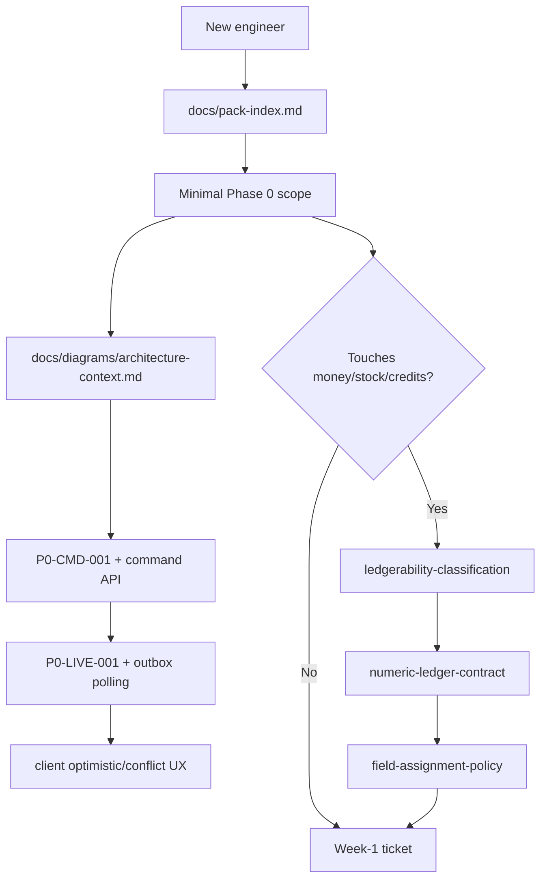

# Engineer Onramp - Day 1

## Objective

Give a new engineer enough context to make a safe first contribution without reading the whole pack.

## Read first

1. `README.md` - pack purpose and minimal scope.
2. `docs/pack-index.md` - execution order and ownership.
3. `docs/diagrams/architecture-context.md` - system shape.
4. `docs/plan/week1-vertical-slice-kickoff.md` - first tickets.
5. The gate for your first ticket.

## Phase 0 mental model

Every editable spreadsheet cell is only a projection of normalized ERP data. A cell edit is a command. A command is not safe until it has:

```text
idempotent command identity
+ current-state mutation
+ audit event
+ domain event
+ outbox event
+ observable command status
+ recoverable client behavior after network loss
```

## Must-have slice

Work only on the minimal vertical slice until it passes `docs/plan/vertical-slice-acceptance-checklist.md`.

| In scope now | Out of scope until slice passes |
|---|---|
| One safe editable cell | Full grid polish |
| Command status API | Import/export |
| Durable outbox polling | NOTIFY enablement |
| SSE initial snapshot/replay | Rich collaboration cursors |
| Unknown-outcome recovery | Complex formulas |
| Privacy-safe command log | Broad workflow actions |

## First local validation

```bash
./scripts/validate-pack.sh
```

Expected result:

```text
Pack validation passed for v0.13.
Pack health score: 100/100
```

## First PR checklist

Before opening a PR:

- Link the relevant gate card.
- Link the SLO target.
- Include the validation output.
- Include test evidence URIs or mark them as intentionally pending with owner approval.
- Confirm no large normative text was duplicated from the spec into secondary docs.

## Numeric ledger mental model

If your ticket touches money, stock, reservations, customer credits, quotas, or capacity, read these before coding:

1. `docs/data/numeric-ledger-contract.md`
2. `docs/dev/numeric-ledger-plane.md`
3. `docs/plan/post-mvp-tigerbeetle-transition.md`

MVP remains PostgreSQL-backed, but conserved numeric movement must already look like TigerBeetle-compatible debit/credit transfers. Do not add mutable balance updates outside `NumericLedgerPort`.

## Minimal reading path diagram



For non-ledger Phase 0 work, do not read the full TigerBeetle section on Day 1. Read it only when your ticket touches conserved numeric movement.
