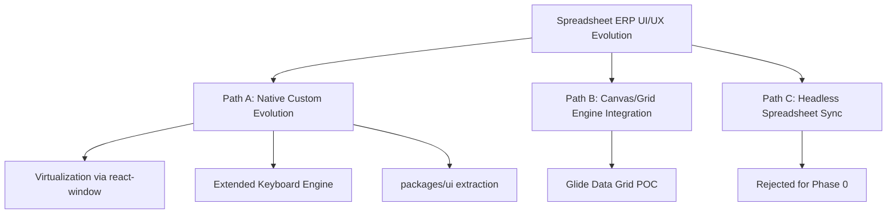

# UI/UX Improvement & Alternative Development Paths Report

**Document ID:** REP-UI-UX-PATHS-001  
**Version:** 0.18.0  
**Date:** 2026-06-30  
**Status:** Accepted (Hybrid A+B)  
**Author:** Antigravity AI  

---

## 1. Introduction & Context

In a Spreadsheet-Native ERP, the User Experience (UX) determines whether the system feels like a clunky database wrapper or a fluid, empowering business operating system. Users expect the responsiveness, familiarity, and keyboard efficiency of Excel/Google Sheets, combined with the structured workflows and transaction safety of a modern ERP.

This report audits the current UI/UX architecture, identifies friction points, and records the accepted developmental path for the v0.18.0 pack.

---

## 2. Current UI/UX Architecture Assessment

The Spreadsheet-Native ERP v0.18.0 frontend comprises:

1. **SpreadsheetGrid (`SpreadsheetGrid.tsx`):** Custom React table; cell mutations invoke `cell.update` commands. Keyboard nav, range select, search, footer SUM shipped.
2. **Tiled Workspace (`TiledWorkspace.tsx`):** Seven business presets with **resizable tile dividers** (pointer-capture splits). Grid, detail, explorer, graph, and actions tiles.
3. **Business Command Center (`BusinessCommandCenter.tsx`):** Domain command forms (`payment.record`, `fulfillment.allocate`, etc.).

### Current limitations (accurate as of v0.18.0 audit)

- **No virtualization:** Large workbooks (1,000+ rows) cause DOM inflation; BENCH-UX-001 blocked.
- **Column metadata unused:** Server discovers `__type__`/`__enum__` meta; UI renders plain text.
- **`cell.update` bypass:** Business-critical columns editable without domain command protection.
- **Cross-workbook refresh manual:** No `affects_workbooks` outbox fan-out; hardcoded refresh lists.
- **Column add stub:** "+" header is local-only; no server `column.add` command.
- **Flattened order clutter:** SalesOrders header fields repeat per line; no client grouping.
- **Pending state UX:** Overlays exist but ambiguity/`SYNC_REQUIRED` copy incomplete in some paths.
- **`page.tsx` monolith:** Orchestration not yet extracted to hooks/`packages/ui`.

### Shipped since initial draft (removed from gap list)

- ~~Rigid pane layouts~~ — Resizable tile dividers shipped in `TiledWorkspace.tsx`.
- ~~Limited Tab/Enter~~ — Tab wrap, Enter-down-on-commit, F2, type-to-enter shipped.

---

## 3. Alternative Development Paths

### Path A: Native Custom Evolution (Incremental Upgrade)

- Grid virtualization via `react-window`
- Extended shortcut engine (Ctrl+Arrow, Shift+Arrow range)
- Extract shared components to `packages/ui`

**Pros:** Full styling control; zero license risk; Phase 0 compliant.  
**Cons:** High cost to match Excel copy-paste, filters, and advanced selection.

### Path B: Glide Data Grid POC

Canvas-based grid; wire `onCellEdited` → `cell.update`. Evaluate per ADR-0028.

**Pros:** Near-native performance at scale.  
**Cons:** Integration complexity; theme alignment work.

### Path C: Headless Spreadsheet Architecture

**Rejected for Phase 0:** Conflicts with per-command identity, ambiguity recovery, and command_log model.

---

## 4. Evaluation Matrix

| Criteria | Path A | Path B (Glide POC) | Path C |
|---|---|---|---|
| Development cost | Medium-High | Medium | High |
| Performance | Good (with virtualization) | Excellent | Excellent |
| Excel feel | Medium | High | High |
| Phase 0 compatibility | 100% | 100% (if wired to commands) | 80% |
| Styling control | Maximum | Good | Maximum |

---

## 5. Accepted Action Plan (v0.18.0)

**Hybrid A+B** plus command-synergistic enhancements from `docs/data/sme-ecommerce-schema-critical-review-and-ux-alternatives.md`:

### Phase 1 — UX synergy (AGENT-061..063)

1. Column metadata rendering (enum, currency, read-only/protected hints).
2. `affects_workbooks` cross-workbook tile auto-refresh.
3. Flattened SalesOrders client grouping + HDR row styling.
4. Action column prototype for one domain command.

### Phase 2 — Scale and structure (AGENT-064..065)

1. `react-window` virtualization in main path.
2. Glide Data Grid POC branch per ADR-0028.
3. Extract `packages/ui`; refactor `page.tsx` into hooks.

### Phase 3 — Gate evidence

1. AGENT-090 vertical slice acceptance.
2. BENCH-UX-001..003 benchmarks.
3. P1-UX-001 tiled workspace spike.

---

## 6. References

- `spec/spreadsheet_native_erp_technical_spec_v0_18_0_research_driven_phase0_ui_ux_audit_complete_execution.md` §11
- `docs/ui/spreadsheet-native-ux-specification.md`
- `docs/adr/ADR-0028-grid-engine-dar.md`
- `docs/implementation/phase0-agent-work-orders.md` (AGENT-061..065)