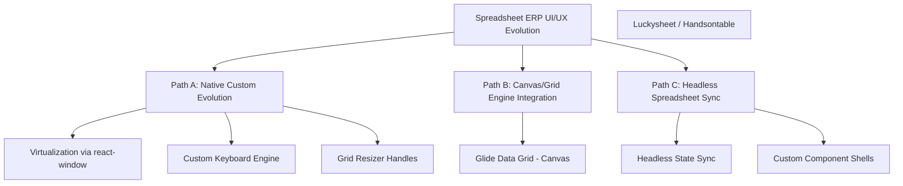

# UI/UX Improvement & Alternative Development Paths Report

**Document ID:** REP-UI-UX-PATHS-001  
**Version:** 0.17.0  
**Date:** 2026-06-30  
**Status:** Under Review  
**Author:** Antigravity AI  

---

## 1. Introduction & Context

In a Spreadsheet-Native ERP, the User Experience (UX) determines whether the system feels like a clunky database wrapper or a fluid, empowering business operating system. Users expect the responsiveness, familiarity, and keyboard efficiency of Excel/Google Sheets, combined with the structured workflows and transaction safety of a modern ERP.

This report audits the current UI/UX architecture, identifies major friction points, and outlines three distinct developmental paths to elevate the spreadsheet interface.

---

## 2. Current UI/UX Architecture Assessment

The Spreadsheet-Native ERP v0.17.0 frontend is structured across three core visual elements:

1. **SpreadsheetGrid (`SpreadsheetGrid.tsx`):** A custom React table rendering rows and columns from `current_cell_values`. Cell mutations invoke database transaction commands. Column widths are saved locally.
2. **Tiled Workspace (`TiledWorkspace.tsx`):** Arranges Explorer, Grid, Graph, and Command panels side-by-side. Supports layout presets (e.g., OTC, Returns, Procurement).
3. **Business Command Center (`BusinessCommandCenter.tsx`):** Side panel displaying forms for invoking high-level business mutations (e.g., `payment.record`, `fulfillment.allocate`).

### Current Limitations:
- **No Virtualization:** Large workbooks (1,000+ rows) cause significant DOM inflation and rendering lag.
- **Friction in Inline Editing:** Arrow key navigation is limited, and Excel conventions (e.g., double-clicking, Esc to abort edit, Tab to advance column, Enter to advance row) are not fully realized.
- **Rigid Pane Layouts:** Tiled views are fixed. There is no support for dragging/resizing grid splits or floating/detaching panes.
- **Pending/Ambiguous State Visuals:** Pending command states are simple indicator classes. They do not offer detailed popovers or micro-animations describing why a block is pending or failed.

---

## 3. Alternative Development Paths

To address these limitations, we evaluate three alternative development paths for the engineering team:

---

### Path A: Native Custom Evolution (Incremental Upgrade)
This path focuses on iteratively upgrading our existing custom React components, keeping the dependency footprint minimal and maintaining total control over styling and layout.

* **Key Deliverables:**
  1. **Grid Virtualization:** Integrate `react-window` or `react-virtualized` to render only the visible viewport of cells, allowing millions of cells to load smoothly.
  2. **Extended Shortcut Engine:** Implement an Excel-compliant keyboard state machine supporting Ctrl+Arrow jumps, Shift+Arrow cell range selection, and Tab/Enter cell cycling.
  3. **Resizable Panes:** Replace the static CSS Grid in `TiledWorkspace` with resizable pane layouts using `@allotment/react` or `react-resizable-panels`.
* **Pros:** Complete styling control; zero risk of license conflicts; very easy to keep Phase 0 compliant.
* **Cons:** High development cost to recreate complex grid capabilities (selection boxes, copy-paste buffers, and filters).

---

### Path B: Integrating Specialized Grid Engines (Glide Data Grid / Luckysheet)
This path replaces the custom `SpreadsheetGrid` with a professional-grade open-source grid engine optimized for performance or sheets fidelity.

* **Option 1: Glide Data Grid (Recommended for Performance)**
  - A canvas-based, hyper-fast grid engine developed by Glide. It easily renders 1,000,000+ rows, supports native column resizing, cell editing, and selection boxes.
* **Option 2: Luckysheet or Handsontable (Recommended for Google Sheets Fidelity)**
  - High-feature spreadsheet engines that support complex formulas, cell styling, chart embedding, and range selections out of the box.
* **Pros:** Instant access to advanced grid features (sorting, filtering, rich data cell types, bulk selections); near-perfect performance.
* **Cons:** High integration complexity; styling may clash with custom CSS design tokens; potential bundle size inflation.

---

### Path C: Headless Spreadsheet Architecture (Airtable-Style)
This path decouples the grid UI from the data plane, turning the frontend grid into a "headless viewer" that communicates changes to a local state manager, which asynchronously flushes commands to the backend API.

* **Key Deliverables:**
  1. **Headless State Manager:** Maintains a local memory replica of the cells.
  2. **Batch Transaction Queue:** Aggregates individual cell updates into a transaction and submits them via the `/commands` API.
  3. **Visual Optimistic Layer:** Renders values immediately in green/blue states, sliding them into committed states once the outbox SSE broadcasts success.
* **Pros:** Highly responsive UI/UX; offline-first capability; decoupling of cell state from rendering layers.
* **Cons:** Extremely complex state synchronization and conflict resolution logic.

---

## 4. Evaluation and Comparison Matrix

| Criteria | Path A: Native Custom | Path B: Grid Engine (Glide) | Path C: Headless Sync |
|---|---|---|---|
| **Development Cost** | Medium-High (Custom logic) | Medium (Integration work) | High (Sync protocols) |
| **Performance (Scale)** | Good (with virtualization) | Excellent (Canvas-backed) | Excellent (Offline-first) |
| **UX Polish & Excel Feel**| Medium (Requires iteration)| High (Native Excel features) | High (Instant response) |
| **Phase 0 Compatibility**| 100% (Direct wrapper) | 100% (Wired to commands) | 80% (Requires buffer changes) |
| **Styling & Theme Control**| Maximum | Good (via canvas theme API)| Maximum |

---

## 5. Recommendation Action Plan

For the immediate next steps, we recommend a **Hybrid Approach (Path A + Path B)**:

1. **Phase 1 (Immediate UX Wins):**
   - Implement resizable workspace tiles using `react-resizable-panels` in `TiledWorkspace.tsx`.
   - Update `SpreadsheetGrid` to handle basic Tab/Enter arrow navigation.
2. **Phase 2 (Scalability Proof of Concept):**
   - Prototype a branch replacing `SpreadsheetGrid` with **Glide Data Grid**, wiring the `onCellEdited` callback to our existing `cell.update` command pipeline.
   - Audit rendering performance with a 10,000-row test dataset.
