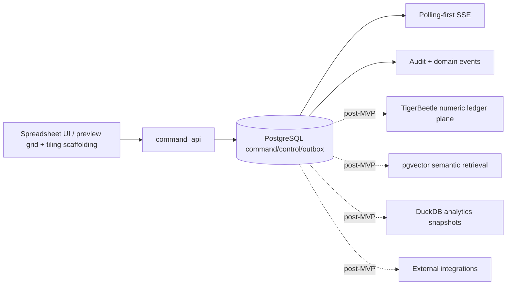

# START HERE — Spreadsheet-Native ERP v0.18.0 Snapshot

**Version:** 0.18.0  
**Last-reviewed:** 2026-06-30  
**Status:** First-read architecture, repository, UI/UX audit snapshot


## Bootstrap achieved

```text
P0-EXEC-001 is green for the runnable bootstrap baseline.
Evidence attached:
  - repo://docs/qa/bootstrap-completion-evidence-v0.17.0.md
  - repo://docs/qa/repository-smoke-test-v0.17.0.md
  - repo://docs/qa/agent-simulation-run-v0.17.0.md

UI/UX audit closure:
  - repo://docs/review/ui_ux_alternative_development_paths.md
  - repo://docs/ui/spreadsheet-native-ux-specification.md
  - repo://docs/adr/ADR-0028-grid-engine-dar.md

Next implementation sequence:
  AGENT-000 -> AGENT-001 -> AGENT-010 -> AGENT-011 -> AGENT-012
    -> AGENT-013 -> AGENT-060 -> AGENT-061..065 -> AGENT-090
```

## Authority map



## Repository tree

```text
repo/
  apps/
    api/       command API, command status, outbox poller, SSE, integration staging stubs
    web/       spreadsheet UI shell (preview tiling) and command-status client
  packages/
    domain/    command/domain types, policies, NumericLedgerPort contract
    db/        migrations, transaction helpers, RLS and SQL invariant wiring
    contracts/ shared API/event contracts
    config/    runtime flags and environment parsing
    observability/ trace and metric wrappers
    testkit/   evidence and fixture helpers
    ui/        reusable UI contracts/components (extract via AGENT-065)
  docs/        active docs plus docs/archive for historical release material
  invariants/  invariant manifests and SQL invariant checks
  tests/       manifest and fixtures
  scripts/     validation and smoke-test utilities
```

## Phase 0 target

```text
one safe spreadsheet edit
  -> command_log claim
  -> PostgreSQL business transaction
  -> audit/domain/outbox events
  -> polling-first SSE
  -> command-status recovery
```

## What agents may NOT do today

```text
1. Do not bypass command_api for any mutation.
2. Do not bypass outbox_events for outbound events or live updates.
3. Do not add TigerBeetle, pgvector, DuckDB, broker/CDC, or external connector runtime to Phase 0.
4. Do not treat preview tiling as P1-UX-001 completion before vertical slice is green.
5. Do not weaken validation, smoke typecheck, or invariants to make a PR pass.
```

## Required first commands

```bash
bash scripts/validate-pack.sh
bash scripts/smoke-typecheck.sh
bash scripts/smoke-package-tests.sh
```

Start coding only after reading:

```text
AGENTS.md
docs/implementation/phase0-agent-work-orders.md
docs/ui/spreadsheet-native-ux-specification.md
docs/implementation/project-directory-structure.md
```

## First coding path

```text
AGENT-000 repository bootstrap
  -> AGENT-001 test/evidence harness
  -> AGENT-010 command_log schema
  -> AGENT-011 command status API
  -> AGENT-012 command transaction boundary + MVP NumericLedgerPort
  -> AGENT-013 client optimistic UX
  -> AGENT-060 vertical slice UI (one safe cell green)
  -> AGENT-061..065 UI/UX synergy improvements
```